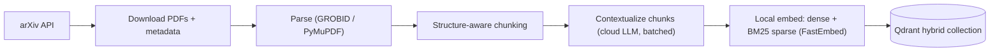
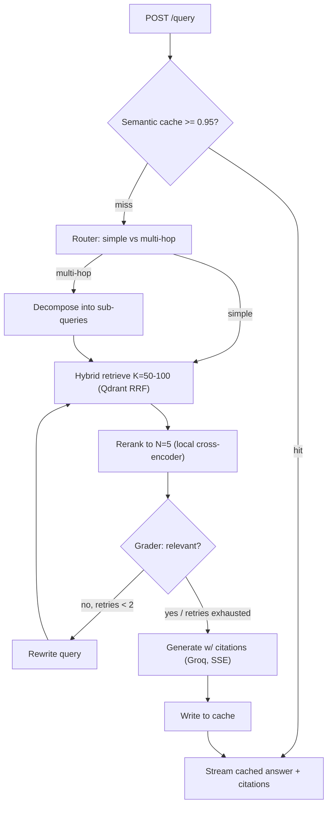

# CoreRAG — End-to-End Implementation Plan

> Companion to `PRD.md`. This plan incorporates four locked decisions:
> **(1)** No hard deadline — quality-first. **(2)** GraphRAG/Neo4j dropped from the build
> (kept as a documented future extension). **(3)** Full hosted live demo (UI + public URL).
> **(4)** Hybrid providers — local embeddings + local reranker, cloud LLM for generation/agents only.

---

## 1. Deltas from the PRD (what changed and why)

| PRD said | Plan says | Why |
| :-- | :-- | :-- |
| OpenAI `text-embedding-3-small` | **Local** dense embeddings (FastEmbed, e.g. `BAAI/bge-base-en-v1.5`) | Hybrid decision; $0/call, fully reproducible for a reviewer, no key needed. |
| Groq `llama3-70b-8192` | Groq **current** model (verify live; likely `llama-3.3-70b-versatile`), as a **config value** | `llama3-70b-8192` is an old ID, almost certainly retired. Never hardcode model names. |
| Reranker "just works" | Reranker is a **first-class latency risk**: ONNX/INT8 on CPU (K→N with K≈50) or a small GPU service; benchmarked in P2 | Cross-encoder over 100 pairs on CPU can take seconds → breaks the low-latency claim. |
| Redis cache of `(query, doc_id)` reranker scores | **Cut** (or P2 backlog) | Near-zero hit rate; the semantic cache already covers repeats. |
| Semantic cache ≥ 0.90 | **≥ 0.95–0.97**, tuned; option to cache *context* not just the answer | 0.90 collides opposite-intent queries → wrong cached answers (a hallucination vector). |
| Contextual chunking (ambiguous) | Per-chunk contextualization via a **cheap cloud model + Batch API**, with a doc-summary baseline for A/B | Disambiguate doc-summary (cheap) vs per-chunk (expensive); make it an eval experiment. |
| Propositional extraction (P0-ish) | **Optional ablation arm**, not core v1 | Doing contextual + propositions up front is too much; compare them instead. |
| — | **Add: citations** on every answer | Mandatory for a "hallucination-resistant" literature tool. |
| — | **Add: PDF parsing = GROBID** (+PyMuPDF fallback) | The #1 driver of RAG quality; arXiv PDFs are messy. |
| — | **Add: Langfuse** tracing, **tests + CI**, **golden eval set**, **ablation study** | Quality-first; these are the portfolio's credibility. |
| Neo4j / GraphRAG (Phase 4) | **Removed from build**; documented as §12 future extension | Your decision; keeps scope tight and the vector RAG excellent. |

---

## 2. Architecture

### Ingestion (offline, batch)



### Query (online, per request)



Every node is traced to **Langfuse** (latency + inputs/outputs), which doubles as a demo artifact.

---

## 3. Final tech stack

| Component | Choice | Notes |
| :-- | :-- | :-- |
| Backend | FastAPI (async) | SSE streaming, lifespan-loaded models/clients |
| Orchestration | LangGraph + LangChain `init_chat_model` | provider-agnostic model selection by string |
| Vector DB | Qdrant (Query API + RRF fusion) | one collection, named dense + sparse vectors |
| Dense embed (local) | `Alibaba-NLP/gte-base-en-v1.5` (verify FastEmbed support; else via `sentence-transformers`, `trust_remote_code=True`) | 768-d, 8k context, no query-prefix needed, $0/call |
| Sparse (local) | FastEmbed `Qdrant/bm25` | lexical recall — critical for acronyms/method names |
| Reranker (local) | `Alibaba-NLP/gte-reranker-modernbert-base` via sentence-transformers → ONNX/INT8 or GPU | K→N; benchmarked & tuned in P2 |
| LLM — generation (cloud) | Groq Llama 3.3 (`llama-3.3-70b-versatile`, confirmed live) via config | low-latency token streaming |
| LLM — agents (cloud) | OpenAI `gpt-4o-mini` (router/grader) via config; `with_structured_output` + Pydantic validation-retry | reliable strict JSON for the state machine |
| Semantic cache | RedisVL `SemanticCache` | threshold ~0.95, TTL, version-namespaced |
| PDF parsing | GROBID (Docker) + PyMuPDF fallback | scientific structure (sections, refs) |
| Observability | Langfuse (self-hosted) | trace graph + LLM + retrieval |
| Eval | RAGAS + retrieval metrics (hit@k, MRR, nDCG) | golden set + ablations |
| UI | Next.js (Vercel) | streaming chat + citations + trace panel |
| Dataset | arXiv cs.DC + cs.AR + cs.LG (systems-filtered, 2022+, deduped by ID) | ~150 papers to start, scalable |

---

## 4. Repository structure (revised)

```text
corerag/
├── api/
│   ├── main.py            # app + lifespan (load clients/models) + middleware + tracing
│   ├── routes.py          # /health, /query (SSE), /search (debug), /admin/ingest
│   ├── schemas.py         # Pydantic req/resp incl. Citation, Source
│   └── deps.py            # DI: settings, clients
├── core/
│   ├── config.py          # pydantic-settings: ALL model names / K,N / thresholds / TTLs
│   ├── agents/
│   │   ├── graph.py       # StateGraph assembly + compile
│   │   ├── state.py       # GraphState (TypedDict)
│   │   ├── router.py      # simple vs multi-hop; decomposition
│   │   ├── grader.py      # relevance grade + query rewrite (bounded retries)
│   │   └── generator.py   # answer synthesis + citations + streaming
│   ├── retrieval.py       # Qdrant hybrid search (dense + sparse, RRF)
│   ├── reranker.py        # cross-encoder client (in-proc ONNX or reranker_service)
│   ├── embeddings.py      # local dense + sparse (FastEmbed)
│   ├── cache.py           # RedisVL semantic cache interceptor
│   └── llm.py             # provider-agnostic chat models (gen + fast)
├── reranker_service/      # optional standalone reranker (GPU/ONNX)
│   ├── app.py             # POST /rerank {query, docs} -> scores
│   └── Dockerfile
├── data/
│   ├── fetch_arxiv.py     # arXiv API -> PDFs + metadata.jsonl
│   ├── parse.py           # PDF -> clean structured text
│   ├── chunk.py           # structure-aware chunking (keeps section metadata)
│   ├── contextualize.py   # contextual chunking (+ optional propositions), batched
│   └── index.py           # embed (dense+sparse) + upsert to Qdrant
├── eval/
│   ├── make_testset.py    # synthesize golden Q/A + reference chunks
│   ├── ragas_eval.py      # faithfulness / answer-relevancy / context precision+recall
│   ├── retrieval_eval.py  # hit@k, MRR, nDCG (no LLM judge needed)
│   ├── latency_bench.py   # per-stage p50/p95, cache hit-rate
│   └── ablation.py        # naive vs doc-summary vs contextual (vs propositions) × hybrid × rerank
├── ui/                    # Next.js chat (streaming + citations + trace)
├── tests/                 # pytest unit + integration
├── scripts/               # run_ingest.sh, warm_cache.py, export_onnx.py
├── .github/workflows/ci.yml
├── .env.example
├── docker-compose.yml     # api, qdrant, redis, grobid, langfuse, reranker
├── docker-compose.prod.yml
├── pyproject.toml         # uv/poetry; ruff + mypy config
├── Makefile               # ingest / serve / eval / test / fmt
└── README.md              # architecture diagram + benchmark table (the money shot)
```

---

## 5. Phased build plan

Each phase has a **goal**, **tasks**, **key decisions**, and **acceptance criteria** (testable "done").

### P0 — Foundations
**Goal:** a running skeleton with all infra up, config-driven, observable. Broken into 13 steps across 4 checkpoints. Steps P0.1–P0.4 need no Docker.

**Checkpoint A — Pure-Python skeleton (no Docker) — ✅ COMPLETE**
*(uv 0.12 + managed Python 3.12; config validated; 12 tests green; ruff + mypy-strict clean.)*
- **P0.1 Repo scaffold & deps.** `git init`; package dirs (`api/`, `core/`, `core/agents/`, `data/`, `eval/`, `tests/`, `scripts/`) with `__init__.py`; `pyproject.toml` (uv, runtime + dev groups); `.python-version` (3.12); `.gitignore`. *Done:* `uv sync` ok; `uv run python -c "import api, core"` exits 0.
- **P0.2 Dev tooling.** `ruff` + `mypy` config in `pyproject.toml`; `Makefile` (`fmt`/`lint`/`type`/`test`/`up`/`down`/`serve`/`ingest`/`eval`); `.pre-commit-config.yaml`. *Done:* `make lint` and `make type` pass on the empty skeleton.
- **P0.3 Config module.** `core/config.py`: pydantic-settings `Settings` with every locked value (gen/agents/embed/reranker IDs, K, N, rerank mode, cache threshold+TTL, retry cap, chunk size/overlap, arXiv categories+count+date-floor, collection version, service URLs, keys via env); cached singleton. *Done:* unit test loads from a sample `.env`, asserts defaults, and a malformed value raises `ValidationError`.
- **P0.4 Env & secrets.** `.env.example` covering every field `config.py` reads (OPENAI/GROQ keys, Langfuse public/secret/host, Qdrant/Redis/GROBID URLs); confirm `.env` gitignored. *Done:* `cp .env.example .env` + keys → `Settings()` loads clean.

**Checkpoint B — Infrastructure up (docker-compose) — ✅ core done**
*(Qdrant v1.18.0 + Redis up & verified. P0.6 Langfuse configured but not yet run; P0.7 GROBID deferred to P1 to avoid a multi-GB pull.)*
- **P0.5 Data plane.** `docker-compose.yml`: `qdrant` (pinned, volume, healthcheck, :6333) + `redis` (pinned, volume, :6379). *Done:* `docker compose up -d qdrant redis` → both healthy; `curl :6333/healthz` + `redis-cli ping` ok.
- **P0.6 Observability.** Add `langfuse` + its `postgres` behind `profile: [obs]`. *Note:* Langfuse **v2** = Postgres-only (light, recommended for P0); **v3** also needs ClickHouse/Redis/Minio (heavier) — decide at build. *Done:* Langfuse UI reachable; project created; keys in `.env`.
- **P0.7 Ingestion dep.** Add `grobid` (lightweight CRF image, mem limit, :8070) behind `profile: [ingest]` (not needed for serving). *Done:* `docker compose --profile ingest up -d grobid`; `curl :8070/api/isalive` → `true`.

**Checkpoint C — App online & observable — ✅ core done**
*(FastAPI + `/health` live against Qdrant+Redis: 200 healthy / 503 degraded, verified; structured JSON logs. P0.10 Langfuse tracing deferred — meaningful at P3.)*
- **P0.8 FastAPI skeleton.** `api/main.py` (app factory + `lifespan` building Qdrant/Redis clients from config), `api/deps.py` (DI), `api/schemas.py` (base models), JSON logging, CORS/middleware stub. *Done:* `make serve` boots; `/docs` renders; clients init from settings.
- **P0.9 /health.** `GET /health` pings each dependency (Qdrant, Redis; optionally GROBID/Langfuse), returns per-dep + overall status. *Done:* all-up → `200` green; stop Redis → redis flips to down, overall degraded, no crash.
- **P0.10 Langfuse tracing.** Wire client from config; instrument app + one trivial traced op. *Done:* a request produces a visible trace in the Langfuse UI.

**Checkpoint D — Guardrails — ✅**
*(Integration test via `make test-int`; GitHub Actions CI (quality + service-container integration job); README with architecture diagrams.)*
- **P0.11 Tests skeleton.** `tests/` + pytest config + `conftest.py` (settings override, TestClient); config unit test (P0.3) + `/health` integration test (marked as needing services). *Done:* `make test` green with services up; unit tests green without.
- **P0.12 CI.** `.github/workflows/ci.yml`: uv → install → ruff → mypy → pytest (unit always; integration via Actions `services:` Qdrant+Redis, else skipped). Needs a GitHub remote. *Done:* workflow green on first push.
- **P0.13 README + diagrams.** Quick-start (`make up`/`make serve`/`.env`), the two mermaid diagrams, service-ports table. *Done:* following it from scratch reaches a healthy `/health`.

**Checkpoints:** A after P0.4 · B after P0.7 · C after P0.10 · D (P0 complete) after P0.13.

### P1 — Ingestion pipeline — ✅ COMPLETE: real 150-paper corpus live in Qdrant
*(fetch → **GROBID** parse (default; pymupdf fallback) → token chunk → **per-chunk LLM contextualization** (gpt-4o-mini, front-truncated doc budget for TPM safety) → local **bge-base-en-v1.5** dense + BM25 sparse → Qdrant hybrid upsert. Retrieval proven: a bare numeric table row, unfindable via raw text, is correctly surfaced (0.78 score) for a natural-language query thanks to its generated context. Cost: ~$0.025/3 papers -> ~$1.2 est. for 150. Dense embedder is bge, not gte — FastEmbed lacks gte-v1.5. GROBID uses the `0.9.0-crf` image (501MB, not the 12.5GB full image) and dramatically beats PyMuPDF's section detection (15-26 real sections vs. 1-2). cs.LG keyword filter tightened (dropped bare "LLM"/"large language model", which let non-systems papers slip through; added systems-specific phrases). ****The real (paid) 150-paper run is done: 150/150 papers, 5,227 chunks, cost ≈$1.56 (chunk count matches the dry-run's predicted call count exactly). Verified end-to-end with live hybrid retrieval -- top results for "reducing LLM inference latency" are precisely on-target AI-systems papers with accurate generated context.**
Along the way, ingestion at real scale surfaced and fixed four real bugs (each caught by insisting on full-log/direct verification over trusting exit codes or summaries -- twice a misleading "success" masked a real failure): (1) tiktoken rejects literal special-token strings like `<|endoftext|>`, which a tokenization paper legitimately contains -- fixed via `disallowed_special=()`. (2) GROBID's 2g memory limit caused a real JVM OutOfMemoryError partway through 150 sequential PDFs, silently degrading 57% of papers to the worse PyMuPDF fallback -- fixed by raising to 5g (verified 0 fallbacks/0 OOM). (3) `is_paper_indexed`'s Qdrant `count(exact=False)` (approximate mode) returned a nonzero count for an arxiv_id that didn't exist -- would have skipped and never indexed all 150 papers -- fixed to `exact=True`. (4) Sustained real load exceeded the account's 200k TPM limit (retry-after-429 alone wasn't enough once demand was structurally above capacity) -- fixed with a proactive `_TokenBucket` rate limiter; a later run also crashed on an uncaught `httpx.ReadTimeout` (retry logic only handled HTTP status errors, not transport-level failures) -- fixed with a second exception handler. Idempotent resume (`is_paper_indexed` + skip logic) made every interruption safe -- no data loss, no double-billing, across 4 run attempts. One stale off-topic paper (indexed before the cs.LG keyword tightening) was found via a Qdrant-vs-metadata.jsonl set-diff and removed, leaving the corpus exactly matching the intended 150-paper query. 30 tests passing, mypy strict clean throughout.)*
**Goal:** 150 papers → clean, contextualized, hybrid-indexed chunks in Qdrant.
- `fetch_arxiv.py`: query categories (TBC — see §11), download PDFs + metadata (id, title, authors, date, url).
- `parse.py`: GROBID → sections/paragraphs; PyMuPDF fallback; strip references/figure noise.
- `chunk.py`: structure-aware, ~512 tokens / ~64 overlap; carry `{paper_id, title, section, chunk_id, url}`.
- `contextualize.py`: per-chunk context via cheap cloud model, **batched** (OpenAI Batch API or Groq); also emit a doc-summary-prepend variant for the A/B; guard cost with a dry-run token estimator.
- `embeddings.py` + `index.py`: FastEmbed dense + BM25 sparse; create Qdrant collection with named vectors; upsert with payload; **version/namespace** the collection for clean re-ingest.
- **Key decisions:** PDF parser (GROBID recommended), chunk size/overlap, contextualization model + batch strategy.
- **Done when:** collection populated; a manual Qdrant query returns sane chunks with full citation payload; ingestion is idempotent & re-runnable; cost logged.

### P2 — Retrieval core (+ the reranker benchmark)
**Goal:** two-stage retrieval as a tested module, with proven latency.
- `retrieval.py`: Qdrant Query API — `prefetch` dense + sparse, `FusionQuery(RRF)`, return K candidates.
- `reranker.py`: cross-encoder scoring K→N; run in a threadpool (don't block the event loop); cap doc length.
- `scripts/export_onnx.py`: ONNX + INT8 dynamic quantization for CPU; toggle GPU vs `reranker_service`.
- `/search` debug endpoint: returns candidates pre/post-rerank with scores + timings.
- **Benchmark:** latency for K∈{30,50,100}, CPU-ONNX vs GPU; pick K and deployment mode from data.
- **Key decisions:** rerank K (start 50), CPU-ONNX vs GPU host, in-process vs separate service.
- **Done when:** `/search` returns well-ordered top-5 with citations; documented p50/p95 for the chosen config; reranker latency is acceptable for the demo (target: rerank < ~300–500 ms warm).

### P3 — LangGraph orchestration + streaming + citations
**Goal:** the agentic query path end to end.
- `state.py`: `GraphState` (query, route, sub_queries, candidates, reranked, grade, retries, answer, citations, confidence).
- `router.py`: classify simple vs multi-hop; decompose + retrieve-per-subquery + merge; **structured output**.
- `grader.py`: score top-N relevance; if low and `retries < 2` → rewrite query → loop; else proceed with a `low_confidence` flag.
- `generator.py`: synthesize with inline `[n]` citations mapped to sources; **stream tokens**; instruct abstention when context is weak (hallucination guardrail).
- `graph.py`: wire nodes + conditional edges + max-retry circuit breaker.
- `/query` (SSE): stream tokens, then a final sources event; every node traced.
- **Key decisions:** router/grader model + structured-output format; abstention policy; retry cap (2).
- **Done when:** `/query` streams a grounded, cited answer for a real question; a deliberately off-topic query triggers ≥1 rewrite then a graceful low-confidence answer; full trace visible in Langfuse.

### P4 — Semantic cache
**Goal:** sub-100ms answers on repeats without cross-intent collisions.
- `cache.py`: RedisVL `SemanticCache`, threshold ~0.95 (tunable), TTL, version-namespaced; interceptor before graph invoke; write-through after generation (answer + citations).
- Optional: cache retrieved *context* separately (still runs generation) as a safer middle ground.
- **Key decisions:** threshold, what to cache (answer vs context), invalidation on re-ingest.
- **Done when:** repeat query returns from cache (traced as a hit, no LLM/retrieval calls); a near-duplicate but opposite-intent query is measured to *not* false-hit at the chosen threshold.

### P5 — Evaluation (the credibility layer)
**Goal:** numbers that make the portfolio defensible.
- `make_testset.py`: synthesize ~100–150 Q/A grounded in specific chunks (so we get reference contexts) + spot-check; store golden set.
- `retrieval_eval.py`: hit@k, MRR, nDCG (no LLM judge) — clean, reproducible.
- `ragas_eval.py`: faithfulness, answer relevancy, context precision/recall (pin RAGAS version — its API churns).
- `latency_bench.py`: per-stage p50/p95, cache hit-rate.
- `ablation.py`: **naive vs doc-summary vs contextual (vs propositions)** × hybrid on/off × reranker on/off → a table.
- **Done when:** README carries a results table showing each component earns its place (e.g., reranker ↑ precision, contextual ↑ recall, cache ↓ p50); reproducible via `make eval`.

### P6 — Hosted live demo
**Goal:** a public URL a reviewer/professor can click.
- `ui/` (Next.js): chat with streaming, rendered citations (clickable arXiv links), and a trace/latency panel.
- Topology: **Qdrant Cloud (free)** + **Upstash Redis (free)** + backend on Fly.io/Render + **reranker ONNX-CPU (K=50) in-container** to start (flip to a GPU service if latency demands) + UI on Vercel.
- `docker-compose.prod.yml`, CORS, rate limiting, API key, HTTPS, a small pre-warmed cache.
- **Done when:** public URL streams cited answers end-to-end; cold + warm latency documented; demo is stable under a few concurrent users.

### P7 — (Not built) GraphRAG future extension
Documented design only (Neo4j + entity/relationship extraction + a router branch, or a lightweight entity co-occurrence graph). Kept in the README as "how this extends" for the Prof. Mukherjea pitch. **No code this cycle.**

---

## 6. Cross-cutting concerns

- **Config surface (`core/config.py`):** model names (gen/agents/embed/rerank), K, N, rerank mode (cpu-onnx/gpu/service), cache threshold + TTL, retry cap, chunk size/overlap, arXiv categories + count, collection version. Nothing hardcoded in logic.
- **Async correctness:** CPU-bound reranker/embedder run via `run_in_executor`/threadpool so they never block the event loop.
- **Provider-agnostic LLMs:** `init_chat_model("groq:...")` etc.; swap gen/agents providers by config (Groq/OpenAI/Claude) with zero code change.
- **Testing:** unit (RRF fusion, chunking, cache key/threshold, grader parsing, citation mapping) + integration (compose or testcontainers: ingest tiny corpus → `/query`). CI runs lint + type + tests.
- **Secrets:** `.env` (gitignored) + `.env.example`; never commit keys.

---

## 7. Cost estimate (one-time + per-query)

- **Local embeddings + reranker:** $0 per call (compute only).
- **Ingestion contextualization (one-time):** ~20k–40k chunks × cheap model; with Batch API ≈ a few dollars.
- **Eval Q/A generation (one-time):** a few dollars.
- **Per query:** router + grader + generation on cloud LLM = fractions of a cent (Groq); cache hits ≈ $0.
- **Infra:** Qdrant Cloud / Upstash / Vercel free tiers; backend host a few $/mo; GPU only if the reranker benchmark demands it.
- **Rough total:** < ~$20–50 one-time + trivial ongoing. I'll log actuals during ingestion.

---

## 8. Risks & mitigations

| Risk | Mitigation |
| :-- | :-- |
| Reranker latency kills the "low-latency" claim | Benchmark first (P2); ONNX/INT8 + K=50; GPU service if needed |
| Stale/renamed cloud model IDs | Config-driven; verify against live API at build time |
| Semantic cache false hits → wrong answers | Threshold ≥0.95, tuned; option to cache context not answer |
| PDF parsing garbage → bad chunks | GROBID; validate a sample; PyMuPDF fallback |
| Agentic hops inflate cold-path latency | Measure p50/p95; cache as the headline; bounded retries |
| RAGAS API churn | Pin version; keep judge-free retrieval metrics as the stable core |

---

## 9. Suggested execution order

P0 → P1 → P2 (**benchmark reranker before building the graph**) → P3 → P4 → P5 → P6.
Rationale: prove retrieval quality + reranker latency on real data before investing in orchestration and UI.

---

## 10. Locked decisions (resolved 2026-08-02)

1. **Corpus:** arXiv **cs.DC + cs.AR + cs.LG**, cs.LG filtered on *systems-specific* abstract terms (`"inference serving"`, `"model serving"`, `"LLM serving"`, `"KV cache"`, `"throughput"`, `"quantization"`, `"batching"`, `"LLM"`/`"large language model"` — **not** bare `"inference"`, which is overloaded in ML). Filter is metadata-only (arXiv API doesn't full-text search). **Dedup by arXiv ID** across categories, **cap cs.LG share**, **recency floor ~2022+**. ~150 papers to start.
2. **Parser:** **GROBID** (lightweight CRF image, ~2 GB) for the whole corpus; `unstructured` (YOLOX) only as a per-file fallback. **Note:** parsing is *offline* — the serving host never parses PDFs, so GROBID's RAM cost lands only on the ingestion box you control, not the free-tier demo host.
3. **Contextualization:** **per-chunk contextual only** for v1; propositions dropped. (Rationale: dropping is right, but not because 10× vectors slows retrieval — HNSW query latency is ~O(log N). The real costs are ~10× index RAM, ~10× ingest LLM cost, and weaker citation granularity.)
4. **Agents model:** **OpenAI `gpt-4o-mini`** for router + grader (strict JSON for the state machine), **Groq Llama 3.3** for generation. Wrap router/grader in `with_structured_output` + Pydantic validation-retry (robust *and* provider-swappable). Two cloud keys now (OpenAI + Groq) — timeouts on both.
5. **Dense embed:** **`Alibaba-NLP/gte-base-en-v1.5`**. (Real reasons: stronger standalone MTEB retrieval, 8k context, no query-prefix footgun — *not* "latent-space alignment" with the reranker, which don't share a space.) Needs `trust_remote_code=True`; **verify FastEmbed support in P1**, else run dense via `sentence-transformers` and keep FastEmbed for BM25 sparse only.

All five locked. Ready to scaffold **P0** on your go-ahead.
