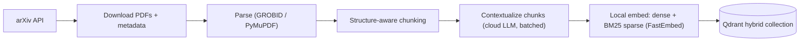
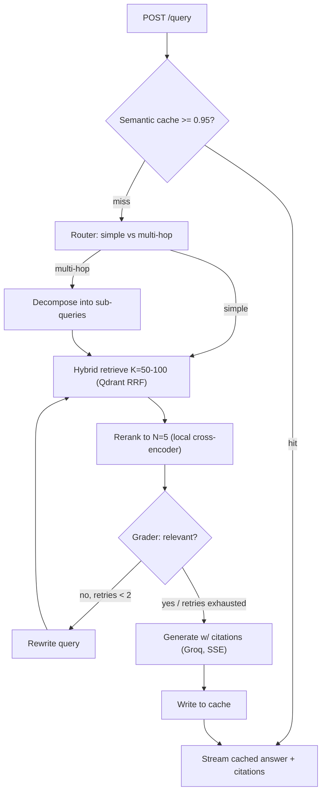
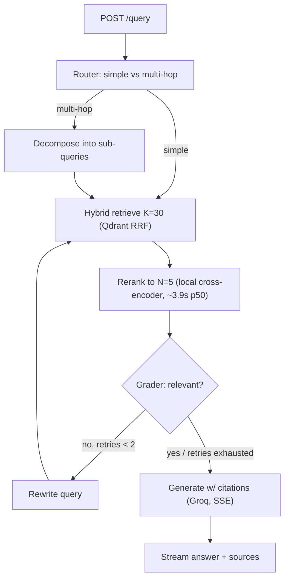

# CoreRAG — End-to-End Implementation Plan

> Companion to `PRD.md`. This plan incorporates four locked decisions:
> **(1)** No hard deadline — quality-first. **(2)** GraphRAG/Neo4j dropped from the build
> (kept as a documented future extension). **(3)** Full hosted live demo (UI + public URL).
> **(4)** Hybrid providers — local embeddings + local reranker, cloud LLM for generation/agents only.

---

## 1. Deltas from the PRD (what changed and why)

| PRD said | Plan says | Why |
| :-- | :-- | :-- |
| OpenAI `text-embedding-3-small` | **Local** dense embeddings (FastEmbed, e.g. `BAAI/bge-base-en-v1.5`) | Hybrid decision; $0/call, fully reproducible for a reviewer, no key needed. |
| Groq `llama3-70b-8192` | Groq **current** model (verify live; likely `llama-3.3-70b-versatile`), as a **config value** | `llama3-70b-8192` is an old ID, almost certainly retired. Never hardcode model names. |
| Reranker "just works" | Reranker is a **first-class latency risk**: ONNX/INT8 on CPU (K→N with K≈50) or a small GPU service; benchmarked in P2 | Cross-encoder over 100 pairs on CPU can take seconds → breaks the low-latency claim. |
| Redis cache of `(query, doc_id)` reranker scores | **Cut** (or P2 backlog) | Near-zero hit rate; the semantic cache already covers repeats. |
| Semantic cache ≥ 0.90 | **≥ 0.95–0.97**, tuned; option to cache *context* not just the answer | 0.90 collides opposite-intent queries → wrong cached answers (a hallucination vector). |
| Contextual chunking (ambiguous) | Per-chunk contextualization via a **cheap cloud model + Batch API**, with a doc-summary baseline for A/B | Disambiguate doc-summary (cheap) vs per-chunk (expensive); make it an eval experiment. |
| Propositional extraction (P0-ish) | **Optional ablation arm**, not core v1 | Doing contextual + propositions up front is too much; compare them instead. |
| — | **Add: citations** on every answer | Mandatory for a "hallucination-resistant" literature tool. |
| — | **Add: PDF parsing = GROBID** (+PyMuPDF fallback) | The #1 driver of RAG quality; arXiv PDFs are messy. |
| — | **Add: Langfuse** tracing, **tests + CI**, **golden eval set**, **ablation study** | Quality-first; these are the portfolio's credibility. |
| Neo4j / GraphRAG (Phase 4) | **Removed from build**; documented as §12 future extension | Your decision; keeps scope tight and the vector RAG excellent. |

---

## 2. Architecture

### Ingestion (offline, batch)



### Query (online, per request)



Every node is traced to **Langfuse** (latency + inputs/outputs), which doubles as a demo artifact.

---

## 3. Final tech stack

| Component | Choice | Notes |
| :-- | :-- | :-- |
| Backend | FastAPI (async) | SSE streaming, lifespan-loaded models/clients |
| Orchestration | LangGraph + LangChain `init_chat_model` | provider-agnostic model selection by string |
| Vector DB | Qdrant (Query API + RRF fusion) | one collection, named dense + sparse vectors |
| Dense embed (local) | `Alibaba-NLP/gte-base-en-v1.5` (verify FastEmbed support; else via `sentence-transformers`, `trust_remote_code=True`) | 768-d, 8k context, no query-prefix needed, $0/call |
| Sparse (local) | FastEmbed `Qdrant/bm25` | lexical recall — critical for acronyms/method names |
| Reranker (local) | `Alibaba-NLP/gte-reranker-modernbert-base` via sentence-transformers → ONNX/INT8 or GPU | K→N; benchmarked & tuned in P2 |
| LLM — generation (cloud) | Groq Llama 3.3 (`llama-3.3-70b-versatile`, confirmed live) via config | low-latency token streaming |
| LLM — agents (cloud) | OpenAI `gpt-4o-mini` (router/grader) via config; `with_structured_output` + Pydantic validation-retry | reliable strict JSON for the state machine |
| Semantic cache | RedisVL `SemanticCache` | threshold ~0.95, TTL, version-namespaced |
| PDF parsing | GROBID (Docker) + PyMuPDF fallback | scientific structure (sections, refs) |
| Observability | Langfuse **Cloud** (free tier — changed from self-hosted at P3, see §5 P3 replan) | trace graph + LLM + retrieval |
| Eval | RAGAS + retrieval metrics (hit@k, MRR, nDCG) | golden set + ablations |
| UI | Next.js (Vercel) | streaming chat + citations + trace panel |
| Dataset | arXiv cs.DC + cs.AR + cs.LG (systems-filtered, 2022+, deduped by ID) | ~150 papers to start, scalable |

---

## 4. Repository structure (revised)

```text
corerag/
├── api/
│   ├── main.py            # app + lifespan (load clients/models) + middleware + tracing
│   ├── routes.py          # /health, /query (SSE), /search (debug), /admin/ingest
│   ├── schemas.py         # Pydantic req/resp incl. Citation, Source
│   └── deps.py            # DI: settings, clients
├── core/
│   ├── config.py          # pydantic-settings: ALL model names / K,N / thresholds / TTLs
│   ├── agents/
│   │   ├── graph.py       # StateGraph assembly + compile
│   │   ├── state.py       # GraphState (TypedDict)
│   │   ├── router.py      # simple vs multi-hop; decomposition
│   │   ├── grader.py      # relevance grade + query rewrite (bounded retries)
│   │   └── generator.py   # answer synthesis + citations + streaming
│   ├── retrieval.py       # Qdrant hybrid search (dense + sparse, RRF)
│   ├── reranker.py        # cross-encoder client (in-proc ONNX or reranker_service)
│   ├── embeddings.py      # local dense + sparse (FastEmbed)
│   ├── cache.py           # RedisVL semantic cache interceptor
│   └── llm.py             # provider-agnostic chat models (gen + fast)
├── reranker_service/      # optional standalone reranker (GPU/ONNX)
│   ├── app.py             # POST /rerank {query, docs} -> scores
│   └── Dockerfile
├── data/
│   ├── fetch_arxiv.py     # arXiv API -> PDFs + metadata.jsonl
│   ├── parse.py           # PDF -> clean structured text
│   ├── chunk.py           # structure-aware chunking (keeps section metadata)
│   ├── contextualize.py   # contextual chunking (+ optional propositions), batched
│   └── index.py           # embed (dense+sparse) + upsert to Qdrant
├── eval/
│   ├── make_testset.py    # synthesize golden Q/A + reference chunks
│   ├── ragas_eval.py      # faithfulness / answer-relevancy / context precision+recall
│   ├── retrieval_eval.py  # hit@k, MRR, nDCG (no LLM judge needed)
│   ├── latency_bench.py   # per-stage p50/p95, cache hit-rate
│   └── ablation.py        # naive vs doc-summary vs contextual (vs propositions) × hybrid × rerank
├── ui/                    # Next.js chat (streaming + citations + trace)
├── tests/                 # pytest unit + integration
├── scripts/               # run_ingest.sh, warm_cache.py, export_onnx.py
├── .github/workflows/ci.yml
├── .env.example
├── docker-compose.yml     # api, qdrant, redis, grobid, reranker (Langfuse is now Cloud, not local — see P3 replan)
├── docker-compose.prod.yml
├── pyproject.toml         # uv/poetry; ruff + mypy config
├── Makefile               # ingest / serve / eval / test / fmt
└── README.md              # architecture diagram + benchmark table (the money shot)
```

---

## 5. Phased build plan

Each phase has a **goal**, **tasks**, **key decisions**, and **acceptance criteria** (testable "done").

### P0 — Foundations
**Goal:** a running skeleton with all infra up, config-driven, observable. Broken into 13 steps across 4 checkpoints. Steps P0.1–P0.4 need no Docker.

**Checkpoint A — Pure-Python skeleton (no Docker) — ✅ COMPLETE**
*(uv 0.12 + managed Python 3.12; config validated; 12 tests green; ruff + mypy-strict clean.)*
- **P0.1 Repo scaffold & deps.** `git init`; package dirs (`api/`, `core/`, `core/agents/`, `data/`, `eval/`, `tests/`, `scripts/`) with `__init__.py`; `pyproject.toml` (uv, runtime + dev groups); `.python-version` (3.12); `.gitignore`. *Done:* `uv sync` ok; `uv run python -c "import api, core"` exits 0.
- **P0.2 Dev tooling.** `ruff` + `mypy` config in `pyproject.toml`; `Makefile` (`fmt`/`lint`/`type`/`test`/`up`/`down`/`serve`/`ingest`/`eval`); `.pre-commit-config.yaml`. *Done:* `make lint` and `make type` pass on the empty skeleton.
- **P0.3 Config module.** `core/config.py`: pydantic-settings `Settings` with every locked value (gen/agents/embed/reranker IDs, K, N, rerank mode, cache threshold+TTL, retry cap, chunk size/overlap, arXiv categories+count+date-floor, collection version, service URLs, keys via env); cached singleton. *Done:* unit test loads from a sample `.env`, asserts defaults, and a malformed value raises `ValidationError`.
- **P0.4 Env & secrets.** `.env.example` covering every field `config.py` reads (OPENAI/GROQ keys, Langfuse public/secret/host, Qdrant/Redis/GROBID URLs); confirm `.env` gitignored. *Done:* `cp .env.example .env` + keys → `Settings()` loads clean.

**Checkpoint B — Infrastructure up (docker-compose) — ✅ core done**
*(Qdrant v1.18.0 + Redis up & verified. P0.6 Langfuse configured but not yet run; P0.7 GROBID deferred to P1 to avoid a multi-GB pull.)*
- **P0.5 Data plane.** `docker-compose.yml`: `qdrant` (pinned, volume, healthcheck, :6333) + `redis` (pinned, volume, :6379). *Done:* `docker compose up -d qdrant redis` → both healthy; `curl :6333/healthz` + `redis-cli ping` ok.
- **P0.6 Observability.** *Superseded at P3 replan (2026-08-03):* self-hosted Langfuse (as originally scoped here) was never built — current self-hosting requires the full 6-container stack (Postgres+ClickHouse+Redis+MinIO+web+worker), not the "light, Postgres-only v2" this note assumed. Replaced by **Langfuse Cloud (free tier)**, done as part of P3.0 instead — no local `langfuse` service needed. `docker-compose.yml`'s `langfuse`/`postgres` services (if present) should be removed when P3.0 starts.
- **P0.7 Ingestion dep.** Add `grobid` (lightweight CRF image, mem limit, :8070) behind `profile: [ingest]` (not needed for serving). *Done:* `docker compose --profile ingest up -d grobid`; `curl :8070/api/isalive` → `true`.

**Checkpoint C — App online & observable — ✅ core done**
*(FastAPI + `/health` live against Qdrant+Redis: 200 healthy / 503 degraded, verified; structured JSON logs. P0.10 Langfuse tracing deferred — meaningful at P3.)*
- **P0.8 FastAPI skeleton.** `api/main.py` (app factory + `lifespan` building Qdrant/Redis clients from config), `api/deps.py` (DI), `api/schemas.py` (base models), JSON logging, CORS/middleware stub. *Done:* `make serve` boots; `/docs` renders; clients init from settings.
- **P0.9 /health.** `GET /health` pings each dependency (Qdrant, Redis; optionally GROBID/Langfuse), returns per-dep + overall status. *Done:* all-up → `200` green; stop Redis → redis flips to down, overall degraded, no crash.
- **P0.10 Langfuse tracing.** Wire client from config; instrument app + one trivial traced op. *Done:* a request produces a visible trace in the Langfuse UI.

**Checkpoint D — Guardrails — ✅**
*(Integration test via `make test-int`; GitHub Actions CI (quality + service-container integration job); README with architecture diagrams.)*
- **P0.11 Tests skeleton.** `tests/` + pytest config + `conftest.py` (settings override, TestClient); config unit test (P0.3) + `/health` integration test (marked as needing services). *Done:* `make test` green with services up; unit tests green without.
- **P0.12 CI.** `.github/workflows/ci.yml`: uv → install → ruff → mypy → pytest (unit always; integration via Actions `services:` Qdrant+Redis, else skipped). Needs a GitHub remote. *Done:* workflow green on first push.
- **P0.13 README + diagrams.** Quick-start (`make up`/`make serve`/`.env`), the two mermaid diagrams, service-ports table. *Done:* following it from scratch reaches a healthy `/health`.

**Checkpoints:** A after P0.4 · B after P0.7 · C after P0.10 · D (P0 complete) after P0.13.

### P1 — Ingestion pipeline — ✅ COMPLETE: real 150-paper corpus live in Qdrant
*(Fetch → **GROBID** parse (default; PyMuPDF fallback) → token chunk → **per-chunk LLM contextualization** (gpt-4o-mini, front-truncated doc budget for TPM safety) → local **bge-base-en-v1.5** dense + BM25 sparse → Qdrant hybrid upsert. **Real (paid) run complete: 150/150 papers, 5,227 chunks, cost ≈$1.56.** Verified end-to-end with live hybrid retrieval — e.g. a query for "reducing LLM inference latency" returns precisely on-target papers (ServerlessT2I, KAP, DeltaServe) with accurate generated context, and a bare numeric table row (unfindable via raw text) is correctly surfaced thanks to its generated context.*

*Along the way, real-scale ingestion surfaced and fixed four real bugs (each caught by insisting on full-log/direct verification over trusting exit codes or summaries — twice a misleadingly "successful" status masked a real failure): (1) tiktoken rejects literal special-token strings like `<|endoftext|>`, which a tokenization paper legitimately contains — fixed via `disallowed_special=()`. (2) GROBID's 2g memory limit caused a real JVM OutOfMemoryError partway through 150 sequential PDFs, silently degrading 57% of papers to the worse PyMuPDF fallback — fixed by raising to 5g (verified 0 fallbacks/0 OOM). (3) `is_paper_indexed`'s Qdrant `count(exact=False)` (approximate mode) returned a nonzero count for an arxiv_id that didn't exist — would have skipped and never indexed any paper in a real run — fixed to `exact=True`. (4) Sustained real load exceeded the account's 200k TPM limit (retry-after-429 alone wasn't enough once demand was structurally above capacity) — fixed with a proactive `_TokenBucket` rate limiter; a later run also crashed on an uncaught `httpx.ReadTimeout` (retry logic only handled HTTP status errors, not transport-level failures) — fixed with a second exception handler. Idempotent resume (`is_paper_indexed` + skip logic) made every interruption safe — no data loss, no double-billing, across 4 run attempts. One stale off-topic paper (indexed before the cs.LG keyword tightening) was found via a Qdrant-vs-metadata.jsonl set-diff and removed. 30 tests passing, mypy strict clean throughout.)*

**Goal:** 150 papers → clean, contextualized, hybrid-indexed chunks in Qdrant.
- `fetch_arxiv.py`: query categories (TBC — see §11), download PDFs + metadata (id, title, authors, date, url).
- `parse.py`: GROBID → sections/paragraphs; PyMuPDF fallback; strip references/figure noise.
- `chunk.py`: structure-aware, ~512 tokens / ~64 overlap; carry `{paper_id, title, section, chunk_id, url}`.
- `contextualize.py`: per-chunk context via cheap cloud model, **batched** (OpenAI Batch API or Groq); also emit a doc-summary-prepend variant for the A/B; guard cost with a dry-run token estimator.
- `embeddings.py` + `index.py`: FastEmbed dense + BM25 sparse; create Qdrant collection with named vectors; upsert with payload; **version/namespace** the collection for clean re-ingest.
- **Key decisions:** PDF parser (GROBID recommended), chunk size/overlap, contextualization model + batch strategy.
- **Done when:** collection populated; a manual Qdrant query returns sane chunks with full citation payload; ingestion is idempotent & re-runnable; cost logged.

### P2 — Retrieval core (+ the reranker benchmark) — ✅ COMPLETE
**Goal:** two-stage retrieval as a tested module, with proven latency, against the real 150-paper corpus.
**Result:** hybrid retrieval + reranking work end-to-end against the real corpus via `GET /search`, with citations and a full timing breakdown. Latency target explicitly **deferred, not met** (~3.9s p50 accepted for v1 per user decision after seeing corrected benchmark data — see P2.4). Along the way: 1 mypy-caught null-safety bug (P2.1), 1 real async/CoreML production crash bug found and fixed (P2.3), 1 self-caught MPS-mislabeling benchmark bug corrected before it reached a final decision (P2.4). 48 tests passing, mypy strict clean throughout.

**Environment reality check (2026-08-03):** dev machine is **Apple M5 (arm64, no CUDA)** — the plan's original "CPU-ONNX vs GPU" framing assumed a possible NVIDIA path. Since P6's hosted demo targets a plain CPU cloud host (Fly.io/Render, no GPU, no Apple Silicon), **portable CPU-ONNX latency is the number that actually decides K/deployment-mode** — that's what the free-tier host will experience. Apple Silicon acceleration (CoreML execution provider / PyTorch MPS) is measured as a bonus local-dev data point only, never the decision driver. `onnxruntime` is already installed (pulled in transitively by FastEmbed) — no GPU-specific tooling needed. Config already has every field this phase needs (`reranker_model`, `reranker_mode`, `reranker_service_url`, `reranker_max_length`, `retrieval_k`, `rerank_top_n`) from P0 — no new config surface required, just wiring.

- **P2.1 Hybrid retrieval module** (`core/retrieval.py`) — ✅ **DONE.** `hybrid_search` (dense+sparse RRF) + `dense_search` (ablation baseline); embedding dispatched via `asyncio.to_thread` (CPU-bound, must not block the event loop); `ScoredChunk(Chunk)` return type; `_to_scored_chunk` fails loudly on a missing payload instead of crashing on `**None` (a real mypy-caught issue, not a suppressed one). 38 tests passing (32 unit + 6 integration incl. 2 new retrieval integration tests), mypy strict clean (29 files). Regression test locks in the exact P1-validated retrieval quality: "reducing LLM inference latency" → ServerlessT2I/KAP/DeltaServe, verified against the real 150-paper corpus.
- **P2.2 Reranker baseline (correctness first)** (`core/reranker.py`) — ✅ **DONE.** `gte-reranker-modernbert-base` loads via `sentence-transformers.CrossEncoder` with **no `trust_remote_code` needed** (ModernBERT is natively supported). `rerank`/`rerank_async` (the latter via `asyncio.to_thread`) score + reorder + cut to `rerank_top_n`, replacing the stage-1 RRF score with the reranker's relevance score. Correctness proven twice: (1) synthetic relevant-vs-irrelevant pair scores 0.99 vs 0.53/0.47; (2) on the real corpus, reranking a K=20 pool for "reducing latency in LLM inference serving" promotes DeltaServe/DualDecoder/SpecBox — genuinely on-target papers RRF fusion alone had underranked — locked in as a regression test. **Latency baseline (informal, not the formal P2.4 benchmark): warm reranking was multi-second for K=30–50 on Apple M5** — confirms the plan's #1 risk exactly, and is why P2.3 (ONNX+INT8) exists, not a regression. *(The exact numbers first reported here were later found to be MPS-accelerated, not true CPU — see the P2.3/P2.4 notes below; the qualitative finding — "reranking is slow, needs work" — held regardless.)* `sentence-transformers` added as a dependency; its `CrossEncoder.predict()` has an untyped multimodal signature that doesn't check cleanly under mypy strict — treated as untyped via `follow_imports = "skip"`, same precedent as PyMuPDF. 42 tests passing (32 unit + 10 integration), mypy strict clean (31 files).
- **P2.3 ONNX export + quantization** — ✅ **DONE, with real surprises.** `scripts/export_onnx.py` turned out to be **unnecessary and was not built**: `gte-reranker-modernbert-base`'s HF repo already ships pre-exported ONNX variants (fp32, fp16, int8, uint8, "quantized", q4, q4f16) — no custom export step needed for this model; revisit only if a future reranker swap doesn't ship pre-exported files. `reranker.py` gained a real `reranker_mode="cpu-onnx"` path (`reranker_onnx_file` config, default `onnx/model_int8.onnx`), verified equivalent to the PyTorch baseline on relative relevance (not exact scores — quantization causes real numeric drift, but both agree on which candidate is more relevant).
  - **Real stability bug found and fixed:** ONNX Runtime auto-selects `CoreMLExecutionProvider` on Apple Silicon by default, which **crashed (no traceback) or hung indefinitely** under the exact async + `asyncio.to_thread` pattern `reranker.py` actually uses in production — a genuine, not-hypothetical risk, since this is precisely how the real query path calls the reranker. Fixed by forcing `provider="CPUExecutionProvider"` explicitly.
  - **Real latency surprise:** contrary to the plan's core assumption, **ONNX Runtime's CPU EP was slower than PyTorch's native CPU backend** for this model on Apple M5 — true across *every* variant tested (fp32, int8, uint8, quantized alike), and not fixed by explicit thread-count tuning. Conclusion: PyTorch's ATen backend has mature Apple Silicon kernels for ModernBERT that generic ONNX Runtime CPU currently lacks; **quantization was never the bottleneck here.** `reranker_mode` default changed to **`"pytorch-cpu"`** (a new, added mode) on the strength of this data — `cpu-onnx` stays available and correct, just not the local default. **This must be re-benchmarked on the eventual x86 cloud host (P6) — this Apple-Silicon-specific result may not transfer.**
  - *(Note: the informal K=30/50 latency numbers first reported at this stage — 2.2-3.1s PyTorch, 4.0-5.3s ONNX — turned out to be measurement error, corrected in P2.4 below: "pytorch-cpu" was silently running on Apple's MPS GPU, not CPU. Superseded; see P2.4's table for the real, corrected numbers.)*
  - 43 tests passing (32 unit + 11 integration), mypy strict clean (31 files).
- **P2.4 Latency benchmark** (`eval/latency_bench.py`) — ✅ **DONE, with a self-caught measurement bug.** `sentence-transformers` silently defaults to MPS on Apple Silicon when no `device=` is given — meaning P2.2/P2.3's "PyTorch CPU" numbers were actually **MPS-accelerated**, not portable-CPU, the whole time. Caught before finalizing anything, fixed (`device="cpu"` explicit in `reranker.py::_model()`), and the full benchmark re-run for real. A genuine MPS data point was added separately (`benchmark_mps_bonus`, clearly labeled, never a real `reranker_mode` — the P6 host has no GPU).

  **Corrected results** (p50/p95 ms, real 150-paper corpus, 8 diverse queries):
  | Mode | K=30 | K=50 | K=100 |
  | :-- | :-- | :-- | :-- |
  | **pytorch-cpu** (true CPU, portable) | 3866/4540 | 5867/6890 | 11265/12276 |
  | cpu-onnx (INT8, CPU) | 5707/5828 | 7977/9925 | 15202/18012 |
  | mps-bonus (Apple GPU, local-only) | 3129/3614 | 4325/5171 | 8532/10084 |

  Ranking held (pytorch-cpu < cpu-onnx) even after the correction, but the honest magnitude is worse than first reported. **User decision after seeing the corrected numbers: drop `retrieval_k` default from 50 → 30** (~5.9s → ~3.9s p50, a meaningful free win reranking a 6x funnel down to `rerank_top_n=5`) and **accept ~3.9s p50 for now** — explicit "optimize later if required," not silently absorbed as meeting the original ~300-500ms target, which none of the local options reach. `retrieval_k` default now **30** (was 50).
- **P2.5 `/search` debug endpoint** (`api/routes.py`) — ✅ **DONE.** `GET /search?q=...&k=&n=` wires `hybrid_search` + `rerank_async`; returns `stage1_candidates` (pre-rerank) and `results` (post-rerank), each with full citation payload, plus a `retrieval_ms`/`rerank_ms`/`total_ms` timing breakdown. `k`/`n` query params let you override `retrieval_k`/`rerank_top_n` per-request for debugging; `n > k` returns a clean 400, empty/missing `q` returns 422 (free FastAPI/Pydantic validation). Verified live end-to-end: exact same on-target results as every prior manual check (DeltaServe/ServerlessT2I/DualDecoder for "reducing LLM inference latency"), rerank timing (~3.3s) consistent with the P2.4 benchmark. 48 tests passing (32 unit + 16 integration), mypy strict clean (33 files).

- **Key decisions:** rerank K = **30** (was 50, changed after P2.4 data), reranker mode = **pytorch-cpu** (was assumed cpu-onnx in the original plan — real data contradicted that), in-process vs separate `reranker_service` — not needed at this scale, deferred indefinitely unless a future GPU host changes the calculus.
- **Done when:** `/search` returns well-ordered top-5 with citations; documented p50/p95 for the chosen config (✅ above); reranker latency target is **explicitly deferred, not met** — ~3.9s p50 accepted for v1 on CPU, revisit only if it becomes a real blocker (smaller/faster reranker model is the most promising lever, not framework swaps — already ruled out).

### P3 — LangGraph orchestration + streaming + citations — ✅ COMPLETE
**Goal:** the agentic query path end to end.
**Result:** router → hybrid retrieve+rerank → grader reflection loop (bounded, self-correcting) → streamed, cited generation, all live behind `POST /query` (SSE), traced end-to-end as one coherent Langfuse trace per query. Both headline scenarios (grounded on-topic answer; graceful off-topic abstention) verified live, then locked in as permanent regression tests. Real latency measured honestly: 12.5s-24.3s depending on route/reflection — target explicitly deferred (same call as P2), not silently met. 71 tests total (40 unit + 31 integration), mypy strict clean (47 files). Two genuine third-party typing limitations handled via the established `follow_imports = "skip"` precedent (Langfuse's `.env` bridging need, LangGraph's `add_node` overload resolution) — both root-caused via isolated repros, not guessed at.

**Replanned 2026-08-03, before starting build** (see full rationale below the table):

| Original assumption | Now | Why |
| :-- | :-- | :-- |
| Self-hosted Langfuse (v2, Postgres-only, "light") | **Langfuse Cloud, free tier** | v2's lightweight Postgres-only self-host path is gone — current self-hosting requires the *full* 6-container stack (Postgres+ClickHouse+Redis+MinIO+web+worker). Cloud free tier (50k units/mo, no card, indefinite) sidesteps that entirely and is simpler for P6 too (cloud endpoint reachable from any deploy target). |
| Diagram: "Hybrid retrieve K=50-100" | **K=30** | Stale — P2.4 changed the real default. |
| Retries/multi-hop "just work" | **Explicitly flagged as a compounding latency risk** | P2 found reranking alone costs ~3.9s p50. A grader retry or a multi-hop sub-query re-runs retrieval+rerank from scratch — 2 retries or 3 sub-queries could mean 3-4x that before generation even starts. Not redesigning the reflection loop over this (that's the intended mechanism), but P3.8 measures and reports the real worst-case number honestly rather than assuming happy-path timing. |
| `langgraph`/`langchain-*`, `with_structured_output` | **Not yet installed or verified** | Zero LangChain/LangGraph dependencies exist in the repo yet. Verify the actual current API (`with_structured_output` reliability across OpenAI *and* Groq) empirically before building nodes on top of it — same discipline that caught real bugs in P1/P2. |
| Semantic cache "in front of" the graph (see query diagram) | **Explicitly out of scope for P3** | Cache is P4's job. `/query` calls the graph directly every time for now; P4 adds the interceptor in front of it later. |
| `core/llm.py`, `core/agents/*.py` | **Don't exist yet** | Confirmed empty — this is a from-scratch build, not wiring existing pieces (unlike P2, which had config/schemas already prepped from P0). |

Query diagram (K corrected to 30; cache path deferred to P4, not built in P3):

*(Semantic cache node removed from this diagram — P4 adds it in front of the router.)*

**Sub-steps:**
- **P3.0 Dependencies + Langfuse Cloud + structured-output smoke test** — ✅ **DONE.** Installed `langgraph==1.2.10`, `langchain==1.3.14` (the Langfuse LangChain integration needs the full umbrella package, not just `langchain-core`), `langchain-core==1.5.3`, `langchain-openai==1.4.1`, `langchain-groq==1.1.3`, `langfuse==4.14.2` (a full major ahead of the "v3" found via search — always verify the actually-installed version). All three criteria verified live, not assumed: (a) a real 2-node LangGraph ran end to end; (b) `.with_structured_output(Sentiment)` worked correctly against **both** `gpt-4o-mini` ("positive", 0.95) and Groq Llama 3.3 ("negative", 0.99) on real API calls; (c) a real trace landed in Langfuse Cloud (non-zero trace ID, confirmed via `handler.last_trace_id` after `get_client().flush()`).
  - **Two real bugs found and fixed along the way, both yours to know about:** (1) `GROQ_API_KEY` had gone blank in `.env` (likely cleared while pasting in the Langfuse keys) — you re-added it. (2) The Langfuse onboarding UI's suggested env var, `LANGFUSE_BASE_URL`, didn't match this codebase's config field (`langfuse_host`) — confirmed via `langfuse/skills`' own docs that `LANGFUSE_BASE_URL` is correct (not a mistake), so the field was renamed to `langfuse_base_url` (`core/config.py`, `.env.example`), not the other way around.
  - **A third bug found and fixed, more subtle:** Langfuse's SDK reads `LANGFUSE_PUBLIC_KEY`/`LANGFUSE_SECRET_KEY`/`LANGFUSE_BASE_URL` directly from `os.environ` — but this codebase centralizes all config through `core.config.Settings` (pydantic-settings loads `.env` internally, never exporting to the real process environment). Without a bridge, `CallbackHandler()` silently disables itself ("Client will be disabled") rather than erroring loudly — confirmed this exact failure mode, then confirmed the fix (explicitly setting `os.environ` from `settings` before constructing the client). **This needs to become permanent, reusable code in P3.1**, not stay as an ad-hoc verification snippet.
  - Considered installing the `langfuse/skills` Claude Code skill (the platform's own onboarding suggestion) but **decided against it** — it's mainly a trace/prompt-query tool, not a code generator, and installing it means writing into the user's *global* `~/.claude` environment for a benefit fully achievable by just reading Langfuse's docs directly (which is what actually resolved all three bugs above). Skipped by user's explicit choice, not silently assumed.
- **P3.1 Provider-agnostic LLM clients** (`core/llm.py`) — ✅ **DONE.** `get_agent_model`/`get_generation_model` factories, config-driven. Also `core/tracing.py`: made the P3.0-discovered Langfuse `os.environ` bridge permanent (`get_tracing_handler`, a fresh `CallbackHandler` per request per Langfuse's own guidance, `@lru_cache`\'d env-bridge underneath).
  - **A second, more consequential bug found while writing the integration tests** (not in P3.1's own code — in the test harness itself, `tests/conftest.py`, and it had been silently wrong since P0): the autouse `_hermetic_env` fixture applied its dummy-credential isolation to *every* test including integration ones, **and** a module-level `os.environ.setdefault("OPENAI_API_KEY", "sk-test")` (plain assignment, not `monkeypatch`) permanently shadowed the real key for the whole test session regardless of any fixture logic. This never surfaced before because every integration test up to now only needed real *local services* (Qdrant/Redis/GROBID), never a real *cloud LLM* credential — P3.1's tests were the first to actually exercise it, and they failed with real `401 AuthenticationError`s until fixed. Fixed two ways: (1) the fixture now skips its hermetic override for `@pytest.mark.integration` tests, and clears `get_settings()`'s process-wide `lru_cache` on both paths so a cached Settings object from an earlier test can't leak into the wrong one; (2) the module-level seed now reads real values from `.env` via `dotenv_values` when present, falling back to dummy placeholders only when there's no `.env` (e.g. CI) — `python-dotenv` added as an explicit dev dependency rather than relied on transitively.
  - All P3.0 verification criteria re-confirmed via real, permanent tests this time (not just an ad-hoc script): real OpenAI/Groq calls succeed, a real non-zero Langfuse trace ID is recorded. 55 tests total (36 unit + 19 integration), mypy strict clean (37 files).
- **P3.2 Graph state** (`core/agents/state.py`) — ✅ **DONE.** `GraphState` (TypedDict, `total=False`) plus a `NodeFn` type alias for node-function signatures. Fields: `query` (mutable, rewritten on retry) vs `original_query` (fixed, what the user actually asked — the generator answers this, not a rewrite), `route`, `sub_queries`, `candidates`, `reranked`, `relevant`, `retries`, `low_confidence`, `answer`, `citations`. Reuses `ScoredChunk` from P2.1 directly — no duplicate schema.
- **P3.3 Router node** (`core/agents/router.py`) — ✅ **DONE.** Simple vs multi-hop classification + decomposition via structured output (`RouteDecision`). Verified live: a comparison query ("compare KV cache compression, speculative decoding, and continuous batching") correctly routes `multi_hop` with 3 sub-queries; a focused question correctly routes `simple`.
- **P3.4 Grader node** (`core/agents/grader.py`) — ✅ **DONE.** Grades the reranked top-N via structured output (`GradeResult`); rewrites + loops if not relevant and `retries < settings.max_reflection_retries`, else proceeds with `low_confidence` set. A single authoritative "proceed" signal (`low_confidence` present in the returned partial state) is computed once here and read by the graph's conditional edge, rather than re-deriving the retry-threshold check in two places (a real off-by-one risk avoided by design, not luck).
- **P3.5 Generator node** (`core/agents/generator.py`) — ✅ **DONE.** Synthesizes with inline `[n]` citations mapped to `ScoredChunk` sources; answers `original_query` (not a mid-loop rewrite); an explicit low-confidence framing note when context is weak, instructing honest hedging over confident filler.
- **P3.6 Graph assembly** (`core/agents/graph.py`) — ✅ **DONE.** Wires router → retrieve (composes P2's `hybrid_search` + `rerank_async` directly — no new retrieval logic) → grade → conditional-loop-or-generate. Multi-hop fan-out (one `hybrid_search` per sub-query, deduped by `chunk_id`) only applies on the *first* pass; a grader-triggered retry always does one focused retrieval with the rewritten query, since the rewrite already targets a specific gap, not a re-decomposition.
  - **A genuine mypy/LangGraph limitation, confirmed via three isolated repros, not a bug in this code**: `StateGraph.add_node`'s generic overloads fail to resolve when a node function is passed through *any* typed indirection (a `Callable[...]`-typed variable, a factory function's declared return type) — even though the exact same function passed as a raw literal type-checks fine, and the runtime behavior is 100% correct either way (confirmed by everything below actually running). Treated `langgraph.*` as untyped via `follow_imports = "skip"`, same precedent as PyMuPDF/sentence-transformers, rather than mangle the code shape to dodge an overload-resolution quirk.
  - **Verified live, both of P3's headline scenarios, before writing a single formal test:** (1) a real on-topic query ("reducing latency in LLM inference serving") → `route=simple`, 30→5 candidates, `relevant=True`, a correctly-cited 1658-char answer, **14.1s** total. (2) A deliberately off-topic query ("chocolate chip cookie recipe") → 2 full rewrite+retrieve+rerank+grade cycles, retries exhausted, `low_confidence=True`, and the generator produced an honest abstention ("sources do not establish a recipe... not possible to answer based on the given sources") rather than any hallucination — **21.1s** total. Both numbers are real, not estimated, and directly confirm the replan's compounding-latency flag.
  - 68 tests total (40 unit + 28 integration, including 2 full end-to-end graph tests locking in both scenarios above as permanent regressions), mypy strict clean (46 files).
- **P3.7 `/query` SSE endpoint** (`api/routes.py`) — ✅ **DONE.** Graph built once at startup (`api/main.py` lifespan, `app.state.graph`) rather than per-request. Streams via `graph.astream_events(..., version="v2")`, filtering `on_chat_model_stream` events to `metadata.langgraph_node == "generate"` only — router/grader also stream their own raw structured-output JSON deltas, which must **not** leak into the user-facing answer (verified this distinction matters by inspecting real event streams before writing the filter, not guessing at LangGraph's event shape). Citations come from the `generate` node's own `on_chain_end` event (`event["data"]["output"]`, its literal return dict) — cleaner and more semantically direct than reconstructing them from the top-level graph's final state. SSE format: `event: token` / `event: sources` blocks. Verified live end-to-end with real `curl`: clean token-by-token streaming (240 real tokens) followed by one correctly-populated `sources` event with full citation payload. 71 tests total (40 unit + 31 integration), mypy strict clean (47 files).
- **P3.8 End-to-end verification** — ✅ **DONE.** All three criteria confirmed live: (1) a real on-topic question streams a grounded, correctly-cited answer over SSE; (2) a deliberately off-topic question triggers the reflection loop and ends in a graceful, honest low-confidence abstention, never a hallucination; (3) a full graph run (router → retrieve → grade → generate, however many reflection loops it takes) groups under **one single coherent Langfuse trace** — verified via a consistent non-zero `trace_id` held across every node's LLM calls, not fragmented per-node traces.

  **Honest latency table** (`eval/latency_bench.py --graph`; n=2 real queries/scenario — each sample is a real, costly LLM-backed graph run, so this reports every individual number plainly rather than a fake percentile from n=2):
  | Scenario | Query (truncated) | Time | Route | Retries | Low confidence |
  | :-- | :-- | :-- | :-- | :-- | :-- |
  | simple | "what is speculative decoding?" | **12.5s** | simple | 0 | No |
  | simple | "how does continuous batching work?" | 17.8s | simple | 2 | **Yes** |
  | multi_hop | "Compare KV cache, spec. decoding, batching..." | 24.0s | multi_hop | 2 | Yes |
  | multi_hop | "quantization vs pruning..." | 24.3s | multi_hop | 2 (self-corrected) | No |
  | off_topic | "cookie recipe" | 16.5s | simple | 2 | Yes (correct abstention) |
  | off_topic | "marathon training" | 16.6s | simple | 2 | Yes (correct abstention) |

  **Range: 12.5s (best case, no reflection) to 24.3s (worst case, multi-hop with full reflection)** — directly confirms the replan's compounding-latency flag as real, not hypothetical. Per the earlier user decision, this is accepted for v1, not silently treated as meeting any target.

  **A genuine, not-glossed-over finding**: "how does continuous batching work?" — an unambiguously on-topic, well-covered question — still exhausted both retries and ended `low_confidence=True`. The grader (gpt-4o-mini) can be **overly strict**, not just correctly cautious; this is a real tuning opportunity (prompt refinement or a lower relevance bar), not a bug, and it's flagged here rather than cherry-picking only the clean wins for this report. The quantization-vs-pruning multi-hop query shows the *opposite*, healthy case: 2 rewrites, then a confident, correctly-grounded answer — the reflection loop self-correcting as designed.

- **Key decisions:** router/grader model (OpenAI `gpt-4o-mini`, locked since P0) + structured-output format (**LangChain `.with_structured_output()` — verified working on both OpenAI and Groq in P3.0**); abstention policy; retry cap (2, already config'd); Langfuse Cloud vs self-host (**Cloud**, decided above).
- **Done when:** `/query` streams a grounded, cited answer for a real question; a deliberately off-topic query triggers ≥1 rewrite then a graceful low-confidence answer; full trace visible in Langfuse; end-to-end latency (including worst-case retries) is measured and documented, not assumed.

### P4 — Semantic cache
**Goal:** sub-100ms answers on repeats without cross-intent collisions.
- `cache.py`: RedisVL `SemanticCache`, threshold ~0.95 (tunable), TTL, version-namespaced; interceptor before graph invoke; write-through after generation (answer + citations).
- Optional: cache retrieved *context* separately (still runs generation) as a safer middle ground.
- **Key decisions:** threshold, what to cache (answer vs context), invalidation on re-ingest.
- **Done when:** repeat query returns from cache (traced as a hit, no LLM/retrieval calls); a near-duplicate but opposite-intent query is measured to *not* false-hit at the chosen threshold.

### P5 — Evaluation (the credibility layer)
**Goal:** numbers that make the portfolio defensible.
- `make_testset.py`: synthesize ~100–150 Q/A grounded in specific chunks (so we get reference contexts) + spot-check; store golden set.
- `retrieval_eval.py`: hit@k, MRR, nDCG (no LLM judge) — clean, reproducible.
- `ragas_eval.py`: faithfulness, answer relevancy, context precision/recall (pin RAGAS version — its API churns).
- `latency_bench.py`: per-stage p50/p95, cache hit-rate.
- `ablation.py`: **naive vs doc-summary vs contextual (vs propositions)** × hybrid on/off × reranker on/off → a table.
- **Done when:** README carries a results table showing each component earns its place (e.g., reranker ↑ precision, contextual ↑ recall, cache ↓ p50); reproducible via `make eval`.

### P6 — Hosted live demo
**Goal:** a public URL a reviewer/professor can click.
- `ui/` (Next.js): chat with streaming, rendered citations (clickable arXiv links), and a trace/latency panel.
- Topology: **Qdrant Cloud (free)** + **Upstash Redis (free)** + backend on Fly.io/Render + **reranker ONNX-CPU (K=50) in-container** to start (flip to a GPU service if latency demands) + UI on Vercel.
- `docker-compose.prod.yml`, CORS, rate limiting, API key, HTTPS, a small pre-warmed cache.
- **Done when:** public URL streams cited answers end-to-end; cold + warm latency documented; demo is stable under a few concurrent users.

### P7 — (Not built) GraphRAG future extension
Documented design only (Neo4j + entity/relationship extraction + a router branch, or a lightweight entity co-occurrence graph). Kept in the README as "how this extends" for the Prof. Mukherjea pitch. **No code this cycle.**

---

## 6. Cross-cutting concerns

- **Config surface (`core/config.py`):** model names (gen/agents/embed/rerank), K, N, rerank mode (cpu-onnx/gpu/service), cache threshold + TTL, retry cap, chunk size/overlap, arXiv categories + count, collection version. Nothing hardcoded in logic.
- **Async correctness:** CPU-bound reranker/embedder run via `run_in_executor`/threadpool so they never block the event loop.
- **Provider-agnostic LLMs:** `init_chat_model("groq:...")` etc.; swap gen/agents providers by config (Groq/OpenAI/Claude) with zero code change.
- **Testing:** unit (RRF fusion, chunking, cache key/threshold, grader parsing, citation mapping) + integration (compose or testcontainers: ingest tiny corpus → `/query`). CI runs lint + type + tests.
- **Secrets:** `.env` (gitignored) + `.env.example`; never commit keys.

---

## 7. Cost estimate (one-time + per-query)

- **Local embeddings + reranker:** $0 per call (compute only).
- **Ingestion contextualization (one-time):** ~20k–40k chunks × cheap model; with Batch API ≈ a few dollars.
- **Eval Q/A generation (one-time):** a few dollars.
- **Per query:** router + grader + generation on cloud LLM = fractions of a cent (Groq); cache hits ≈ $0.
- **Infra:** Qdrant Cloud / Upstash / Vercel free tiers; backend host a few $/mo; GPU only if the reranker benchmark demands it.
- **Rough total:** < ~$20–50 one-time + trivial ongoing. I'll log actuals during ingestion.

---

## 8. Risks & mitigations

| Risk | Mitigation |
| :-- | :-- |
| Reranker latency kills the "low-latency" claim | Benchmark first (P2); ONNX/INT8 + K=50; GPU service if needed |
| Stale/renamed cloud model IDs | Config-driven; verify against live API at build time |
| Semantic cache false hits → wrong answers | Threshold ≥0.95, tuned; option to cache context not answer |
| PDF parsing garbage → bad chunks | GROBID; validate a sample; PyMuPDF fallback |
| Agentic hops inflate cold-path latency | Measure p50/p95; cache as the headline; bounded retries |
| RAGAS API churn | Pin version; keep judge-free retrieval metrics as the stable core |

---

## 9. Suggested execution order

P0 → P1 → P2 (**benchmark reranker before building the graph**) → P3 → P4 → P5 → P6.
Rationale: prove retrieval quality + reranker latency on real data before investing in orchestration and UI.

---

## 10. Locked decisions (resolved 2026-08-02)

1. **Corpus:** arXiv **cs.DC + cs.AR + cs.LG**, cs.LG filtered on *systems-specific* abstract terms — **not** bare `"inference"`/`"LLM"`/`"large language model"`, which are overloaded and let non-systems papers slip through (confirmed live: a medical-imaging paper matched only via bare "LLM"). Final tightened list (`core/config.py::arxiv_cslg_keywords`): `"inference serving"`, `"model serving"`, `"LLM serving"`, `"LLM inference"`, `"inference latency"`, `"inference throughput"`, `"KV cache"`, `"key-value cache"`, `"continuous batching"`, `"dynamic batching"`, `"speculative decoding"`, `"tensor parallelism"`, `"model parallelism"`, `"quantization"`, `"GPU memory"`. Filter is metadata-only (arXiv API doesn't full-text search). **Dedup by arXiv ID** across categories, **recency floor 2022+**.
2. **Parser:** **GROBID** (`grobid/grobid:0.9.0-crf`, 501MB — NOT the 12.5GB full image) for the whole corpus; PyMuPDF only as a per-file fallback. Needs **5g** container memory (2g caused a real JVM OOM at 150-paper scale, silently degrading parse quality). Parsing is *offline* — the serving host never parses PDFs.
3. **Contextualization:** **per-chunk contextual only** for v1; propositions dropped. Real ingestion cost: **$1.56 for 150 papers** (not the original ~$1.2 extrapolation — measured exactly). Required a proactive per-process token-bucket rate limiter (`contextualize_tokens_per_minute`) since sustained demand can structurally exceed the account's TPM budget.
4. **Agents model:** **OpenAI `gpt-4o-mini`** for router + grader (strict JSON for the state machine), **Groq Llama 3.3 (`llama-3.3-70b-versatile`, confirmed live)** for generation. Wrap router/grader in `with_structured_output` + Pydantic validation-retry.
5. **Dense embed:** **`BAAI/bge-base-en-v1.5`** via FastEmbed (ONNX, no torch) — reverses the original `gte-base-en-v1.5` pick: FastEmbed has no GTE v1.5 support (only the older `thenlper/gte-base`). bge-base-en-v1.5 has strong standalone MTEB retrieval and keeps the dependency stack light. Reranker stays GTE-ModernBERT (a bi-encoder/cross-encoder don't share a latent space, so embedder/reranker family-matching was never a real justification).

**P0 and P1 are both complete** (see their sections above) — real 150-paper corpus is live in Qdrant. Next: **P2**.
