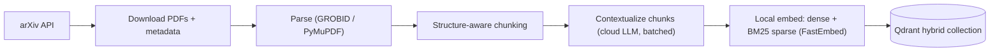
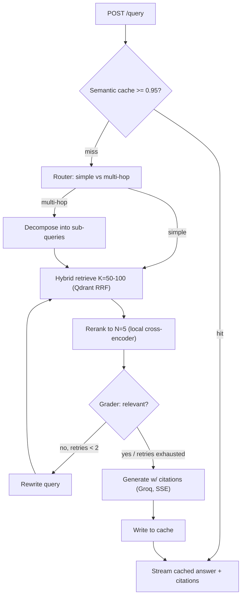
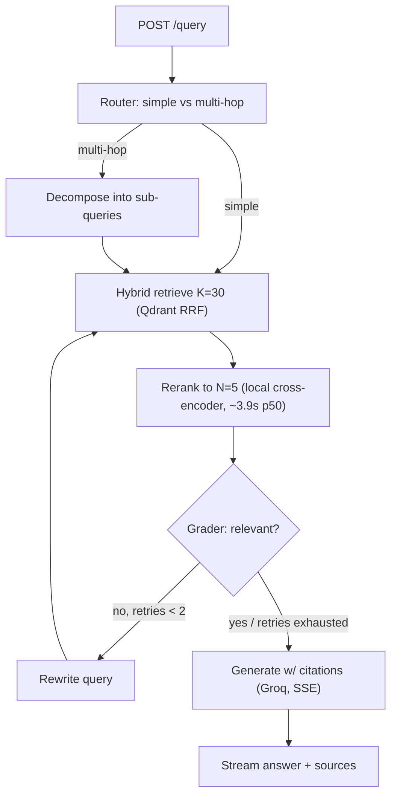

# CoreRAG — End-to-End Implementation Plan

> Companion to `PRD.md`. This plan incorporates four locked decisions:
> **(1)** No hard deadline — quality-first. **(2)** GraphRAG/Neo4j dropped from the build
> (kept as a documented future extension). **(3)** Full hosted live demo (UI + public URL).
> **(4)** Hybrid providers — local embeddings + local reranker, cloud LLM for generation/agents only.

---

## 1. Deltas from the PRD (what changed and why)

| PRD said | Plan says | Why |
| :-- | :-- | :-- |
| OpenAI `text-embedding-3-small` | **Local** dense embeddings (FastEmbed, e.g. `BAAI/bge-base-en-v1.5`) | Hybrid decision; $0/call, fully reproducible for a reviewer, no key needed. |
| Groq `llama3-70b-8192` | Groq **current** model (verify live; likely `llama-3.3-70b-versatile`), as a **config value** | `llama3-70b-8192` is an old ID, almost certainly retired. Never hardcode model names. |
| Reranker "just works" | Reranker is a **first-class latency risk**: ONNX/INT8 on CPU (K→N with K≈50) or a small GPU service; benchmarked in P2 | Cross-encoder over 100 pairs on CPU can take seconds → breaks the low-latency claim. |
| Redis cache of `(query, doc_id)` reranker scores | **Cut** (or P2 backlog) | Near-zero hit rate; the semantic cache already covers repeats. |
| Semantic cache ≥ 0.90 | **≥ 0.95–0.97**, tuned; option to cache *context* not just the answer | 0.90 collides opposite-intent queries → wrong cached answers (a hallucination vector). |
| Contextual chunking (ambiguous) | Per-chunk contextualization via a **cheap cloud model + Batch API**, with a doc-summary baseline for A/B | Disambiguate doc-summary (cheap) vs per-chunk (expensive); make it an eval experiment. |
| Propositional extraction (P0-ish) | **Optional ablation arm**, not core v1 | Doing contextual + propositions up front is too much; compare them instead. |
| — | **Add: citations** on every answer | Mandatory for a "hallucination-resistant" literature tool. |
| — | **Add: PDF parsing = GROBID** (+PyMuPDF fallback) | The #1 driver of RAG quality; arXiv PDFs are messy. |
| — | **Add: Langfuse** tracing, **tests + CI**, **golden eval set**, **ablation study** | Quality-first; these are the portfolio's credibility. |
| Neo4j / GraphRAG (Phase 4) | **Removed from build**; documented as §12 future extension | Your decision; keeps scope tight and the vector RAG excellent. |

---

## 2. Architecture

### Ingestion (offline, batch)



### Query (online, per request)



Every node is traced to **Langfuse** (latency + inputs/outputs), which doubles as a demo artifact.

---

## 3. Final tech stack

| Component | Choice | Notes |
| :-- | :-- | :-- |
| Backend | FastAPI (async) | SSE streaming, lifespan-loaded models/clients |
| Orchestration | LangGraph + LangChain `init_chat_model` | provider-agnostic model selection by string |
| Vector DB | Qdrant (Query API + RRF fusion) | one collection, named dense + sparse vectors |
| Dense embed (local) | `Alibaba-NLP/gte-base-en-v1.5` (verify FastEmbed support; else via `sentence-transformers`, `trust_remote_code=True`) | 768-d, 8k context, no query-prefix needed, $0/call |
| Sparse (local) | FastEmbed `Qdrant/bm25` | lexical recall — critical for acronyms/method names |
| Reranker (local) | `Alibaba-NLP/gte-reranker-modernbert-base` via sentence-transformers → ONNX/INT8 or GPU | K→N; benchmarked & tuned in P2 |
| LLM — generation (cloud) | Groq Llama 3.3 (`llama-3.3-70b-versatile`, confirmed live) via config | low-latency token streaming |
| LLM — agents (cloud) | OpenAI `gpt-4o-mini` (router/grader) via config; `with_structured_output` + Pydantic validation-retry | reliable strict JSON for the state machine |
| Semantic cache | RedisVL `SemanticCache` | threshold ~0.95, TTL, version-namespaced |
| PDF parsing | GROBID (Docker) + PyMuPDF fallback | scientific structure (sections, refs) |
| Observability | Langfuse **Cloud** (free tier — changed from self-hosted at P3, see §5 P3 replan) | trace graph + LLM + retrieval |
| Eval | RAGAS + retrieval metrics (hit@k, MRR, nDCG) | golden set + ablations |
| UI | Next.js (Vercel) | streaming chat + citations + trace panel |
| Dataset | arXiv cs.DC + cs.AR + cs.LG (systems-filtered, 2022+, deduped by ID) | ~150 papers to start, scalable |

---

## 4. Repository structure (revised)

```text
corerag/
├── api/
│   ├── main.py            # app + lifespan (load clients/models) + middleware + tracing
│   ├── routes.py          # /health, /query (SSE), /search (debug), /admin/ingest
│   ├── schemas.py         # Pydantic req/resp incl. Citation, Source
│   └── deps.py            # DI: settings, clients
├── core/
│   ├── config.py          # pydantic-settings: ALL model names / K,N / thresholds / TTLs
│   ├── agents/
│   │   ├── graph.py       # StateGraph assembly + compile
│   │   ├── state.py       # GraphState (TypedDict)
│   │   ├── router.py      # simple vs multi-hop; decomposition
│   │   ├── grader.py      # relevance grade + query rewrite (bounded retries)
│   │   └── generator.py   # answer synthesis + citations + streaming
│   ├── retrieval.py       # Qdrant hybrid search (dense + sparse, RRF)
│   ├── reranker.py        # cross-encoder client (in-proc ONNX or reranker_service)
│   ├── embeddings.py      # local dense + sparse (FastEmbed)
│   ├── cache.py           # RedisVL semantic cache interceptor
│   └── llm.py             # provider-agnostic chat models (gen + fast)
├── reranker_service/      # optional standalone reranker (GPU/ONNX)
│   ├── app.py             # POST /rerank {query, docs} -> scores
│   └── Dockerfile
├── data/
│   ├── fetch_arxiv.py     # arXiv API -> PDFs + metadata.jsonl
│   ├── parse.py           # PDF -> clean structured text
│   ├── chunk.py           # structure-aware chunking (keeps section metadata)
│   ├── contextualize.py   # contextual chunking (+ optional propositions), batched
│   └── index.py           # embed (dense+sparse) + upsert to Qdrant
├── eval/
│   ├── make_testset.py    # synthesize golden Q/A + reference chunks
│   ├── ragas_eval.py      # faithfulness / answer-relevancy / context precision+recall
│   ├── retrieval_eval.py  # hit@k, MRR, nDCG (no LLM judge needed)
│   ├── latency_bench.py   # per-stage p50/p95, cache hit-rate
│   └── ablation.py        # naive vs doc-summary vs contextual (vs propositions) × hybrid × rerank
├── ui/                    # Next.js chat (streaming + citations + trace)
├── tests/                 # pytest unit + integration
├── scripts/               # run_ingest.sh, warm_cache.py, export_onnx.py
├── .github/workflows/ci.yml
├── .env.example
├── docker-compose.yml     # api, qdrant, redis, grobid, reranker (Langfuse is now Cloud, not local — see P3 replan)
├── docker-compose.prod.yml
├── pyproject.toml         # uv/poetry; ruff + mypy config
├── Makefile               # ingest / serve / eval / test / fmt
└── README.md              # architecture diagram + benchmark table (the money shot)
```

---

## 5. Phased build plan

Each phase has a **goal**, **tasks**, **key decisions**, and **acceptance criteria** (testable "done").

### P0 — Foundations
**Goal:** a running skeleton with all infra up, config-driven, observable. Broken into 13 steps across 4 checkpoints. Steps P0.1–P0.4 need no Docker.

**Checkpoint A — Pure-Python skeleton (no Docker) — ✅ COMPLETE**
*(uv 0.12 + managed Python 3.12; config validated; 12 tests green; ruff + mypy-strict clean.)*
- **P0.1 Repo scaffold & deps.** `git init`; package dirs (`api/`, `core/`, `core/agents/`, `data/`, `eval/`, `tests/`, `scripts/`) with `__init__.py`; `pyproject.toml` (uv, runtime + dev groups); `.python-version` (3.12); `.gitignore`. *Done:* `uv sync` ok; `uv run python -c "import api, core"` exits 0.
- **P0.2 Dev tooling.** `ruff` + `mypy` config in `pyproject.toml`; `Makefile` (`fmt`/`lint`/`type`/`test`/`up`/`down`/`serve`/`ingest`/`eval`); `.pre-commit-config.yaml`. *Done:* `make lint` and `make type` pass on the empty skeleton.
- **P0.3 Config module.** `core/config.py`: pydantic-settings `Settings` with every locked value (gen/agents/embed/reranker IDs, K, N, rerank mode, cache threshold+TTL, retry cap, chunk size/overlap, arXiv categories+count+date-floor, collection version, service URLs, keys via env); cached singleton. *Done:* unit test loads from a sample `.env`, asserts defaults, and a malformed value raises `ValidationError`.
- **P0.4 Env & secrets.** `.env.example` covering every field `config.py` reads (OPENAI/GROQ keys, Langfuse public/secret/host, Qdrant/Redis/GROBID URLs); confirm `.env` gitignored. *Done:* `cp .env.example .env` + keys → `Settings()` loads clean.

**Checkpoint B — Infrastructure up (docker-compose) — ✅ core done**
*(Qdrant v1.18.0 + Redis up & verified. P0.6 Langfuse configured but not yet run; P0.7 GROBID deferred to P1 to avoid a multi-GB pull.)*
- **P0.5 Data plane.** `docker-compose.yml`: `qdrant` (pinned, volume, healthcheck, :6333) + `redis` (pinned, volume, :6379). *Done:* `docker compose up -d qdrant redis` → both healthy; `curl :6333/healthz` + `redis-cli ping` ok.
- **P0.6 Observability.** *Superseded at P3 replan (2026-08-03):* self-hosted Langfuse (as originally scoped here) was never built — current self-hosting requires the full 6-container stack (Postgres+ClickHouse+Redis+MinIO+web+worker), not the "light, Postgres-only v2" this note assumed. Replaced by **Langfuse Cloud (free tier)**, done as part of P3.0 instead — no local `langfuse` service needed. `docker-compose.yml`'s `langfuse`/`postgres` services (if present) should be removed when P3.0 starts.
- **P0.7 Ingestion dep.** Add `grobid` (lightweight CRF image, mem limit, :8070) behind `profile: [ingest]` (not needed for serving). *Done:* `docker compose --profile ingest up -d grobid`; `curl :8070/api/isalive` → `true`.

**Checkpoint C — App online & observable — ✅ core done**
*(FastAPI + `/health` live against Qdrant+Redis: 200 healthy / 503 degraded, verified; structured JSON logs. P0.10 Langfuse tracing deferred — meaningful at P3.)*
- **P0.8 FastAPI skeleton.** `api/main.py` (app factory + `lifespan` building Qdrant/Redis clients from config), `api/deps.py` (DI), `api/schemas.py` (base models), JSON logging, CORS/middleware stub. *Done:* `make serve` boots; `/docs` renders; clients init from settings.
- **P0.9 /health.** `GET /health` pings each dependency (Qdrant, Redis; optionally GROBID/Langfuse), returns per-dep + overall status. *Done:* all-up → `200` green; stop Redis → redis flips to down, overall degraded, no crash.
- **P0.10 Langfuse tracing.** Wire client from config; instrument app + one trivial traced op. *Done:* a request produces a visible trace in the Langfuse UI.

**Checkpoint D — Guardrails — ✅**
*(Integration test via `make test-int`; GitHub Actions CI (quality + service-container integration job); README with architecture diagrams.)*
- **P0.11 Tests skeleton.** `tests/` + pytest config + `conftest.py` (settings override, TestClient); config unit test (P0.3) + `/health` integration test (marked as needing services). *Done:* `make test` green with services up; unit tests green without.
- **P0.12 CI.** `.github/workflows/ci.yml`: uv → install → ruff → mypy → pytest (unit always; integration via Actions `services:` Qdrant+Redis, else skipped). Needs a GitHub remote. *Done:* workflow green on first push.
- **P0.13 README + diagrams.** Quick-start (`make up`/`make serve`/`.env`), the two mermaid diagrams, service-ports table. *Done:* following it from scratch reaches a healthy `/health`.

**Checkpoints:** A after P0.4 · B after P0.7 · C after P0.10 · D (P0 complete) after P0.13.

### P1 — Ingestion pipeline — ✅ COMPLETE: real 150-paper corpus live in Qdrant
*(Fetch → **GROBID** parse (default; PyMuPDF fallback) → token chunk → **per-chunk LLM contextualization** (gpt-4o-mini, front-truncated doc budget for TPM safety) → local **bge-base-en-v1.5** dense + BM25 sparse → Qdrant hybrid upsert. **Real (paid) run complete: 150/150 papers, 5,227 chunks, cost ≈$1.56.** Verified end-to-end with live hybrid retrieval — e.g. a query for "reducing LLM inference latency" returns precisely on-target papers (ServerlessT2I, KAP, DeltaServe) with accurate generated context, and a bare numeric table row (unfindable via raw text) is correctly surfaced thanks to its generated context.*

*Along the way, real-scale ingestion surfaced and fixed four real bugs (each caught by insisting on full-log/direct verification over trusting exit codes or summaries — twice a misleadingly "successful" status masked a real failure): (1) tiktoken rejects literal special-token strings like `<|endoftext|>`, which a tokenization paper legitimately contains — fixed via `disallowed_special=()`. (2) GROBID's 2g memory limit caused a real JVM OutOfMemoryError partway through 150 sequential PDFs, silently degrading 57% of papers to the worse PyMuPDF fallback — fixed by raising to 5g (verified 0 fallbacks/0 OOM). (3) `is_paper_indexed`'s Qdrant `count(exact=False)` (approximate mode) returned a nonzero count for an arxiv_id that didn't exist — would have skipped and never indexed any paper in a real run — fixed to `exact=True`. (4) Sustained real load exceeded the account's 200k TPM limit (retry-after-429 alone wasn't enough once demand was structurally above capacity) — fixed with a proactive `_TokenBucket` rate limiter; a later run also crashed on an uncaught `httpx.ReadTimeout` (retry logic only handled HTTP status errors, not transport-level failures) — fixed with a second exception handler. Idempotent resume (`is_paper_indexed` + skip logic) made every interruption safe — no data loss, no double-billing, across 4 run attempts. One stale off-topic paper (indexed before the cs.LG keyword tightening) was found via a Qdrant-vs-metadata.jsonl set-diff and removed. 30 tests passing, mypy strict clean throughout.)*

**Goal:** 150 papers → clean, contextualized, hybrid-indexed chunks in Qdrant.
- `fetch_arxiv.py`: query categories (TBC — see §11), download PDFs + metadata (id, title, authors, date, url).
- `parse.py`: GROBID → sections/paragraphs; PyMuPDF fallback; strip references/figure noise.
- `chunk.py`: structure-aware, ~512 tokens / ~64 overlap; carry `{paper_id, title, section, chunk_id, url}`.
- `contextualize.py`: per-chunk context via cheap cloud model, **batched** (OpenAI Batch API or Groq); also emit a doc-summary-prepend variant for the A/B; guard cost with a dry-run token estimator.
- `embeddings.py` + `index.py`: FastEmbed dense + BM25 sparse; create Qdrant collection with named vectors; upsert with payload; **version/namespace** the collection for clean re-ingest.
- **Key decisions:** PDF parser (GROBID recommended), chunk size/overlap, contextualization model + batch strategy.
- **Done when:** collection populated; a manual Qdrant query returns sane chunks with full citation payload; ingestion is idempotent & re-runnable; cost logged.

### P2 — Retrieval core (+ the reranker benchmark) — ✅ COMPLETE
**Goal:** two-stage retrieval as a tested module, with proven latency, against the real 150-paper corpus.
**Result:** hybrid retrieval + reranking work end-to-end against the real corpus via `GET /search`, with citations and a full timing breakdown. Latency target explicitly **deferred, not met** (~3.9s p50 accepted for v1 per user decision after seeing corrected benchmark data — see P2.4). Along the way: 1 mypy-caught null-safety bug (P2.1), 1 real async/CoreML production crash bug found and fixed (P2.3), 1 self-caught MPS-mislabeling benchmark bug corrected before it reached a final decision (P2.4). 48 tests passing, mypy strict clean throughout.

**Environment reality check (2026-08-03):** dev machine is **Apple M5 (arm64, no CUDA)** — the plan's original "CPU-ONNX vs GPU" framing assumed a possible NVIDIA path. Since P6's hosted demo targets a plain CPU cloud host (Fly.io/Render, no GPU, no Apple Silicon), **portable CPU-ONNX latency is the number that actually decides K/deployment-mode** — that's what the free-tier host will experience. Apple Silicon acceleration (CoreML execution provider / PyTorch MPS) is measured as a bonus local-dev data point only, never the decision driver. `onnxruntime` is already installed (pulled in transitively by FastEmbed) — no GPU-specific tooling needed. Config already has every field this phase needs (`reranker_model`, `reranker_mode`, `reranker_service_url`, `reranker_max_length`, `retrieval_k`, `rerank_top_n`) from P0 — no new config surface required, just wiring.

- **P2.1 Hybrid retrieval module** (`core/retrieval.py`) — ✅ **DONE.** `hybrid_search` (dense+sparse RRF) + `dense_search` (ablation baseline); embedding dispatched via `asyncio.to_thread` (CPU-bound, must not block the event loop); `ScoredChunk(Chunk)` return type; `_to_scored_chunk` fails loudly on a missing payload instead of crashing on `**None` (a real mypy-caught issue, not a suppressed one). 38 tests passing (32 unit + 6 integration incl. 2 new retrieval integration tests), mypy strict clean (29 files). Regression test locks in the exact P1-validated retrieval quality: "reducing LLM inference latency" → ServerlessT2I/KAP/DeltaServe, verified against the real 150-paper corpus.
- **P2.2 Reranker baseline (correctness first)** (`core/reranker.py`) — ✅ **DONE.** `gte-reranker-modernbert-base` loads via `sentence-transformers.CrossEncoder` with **no `trust_remote_code` needed** (ModernBERT is natively supported). `rerank`/`rerank_async` (the latter via `asyncio.to_thread`) score + reorder + cut to `rerank_top_n`, replacing the stage-1 RRF score with the reranker's relevance score. Correctness proven twice: (1) synthetic relevant-vs-irrelevant pair scores 0.99 vs 0.53/0.47; (2) on the real corpus, reranking a K=20 pool for "reducing latency in LLM inference serving" promotes DeltaServe/DualDecoder/SpecBox — genuinely on-target papers RRF fusion alone had underranked — locked in as a regression test. **Latency baseline (informal, not the formal P2.4 benchmark): warm reranking was multi-second for K=30–50 on Apple M5** — confirms the plan's #1 risk exactly, and is why P2.3 (ONNX+INT8) exists, not a regression. *(The exact numbers first reported here were later found to be MPS-accelerated, not true CPU — see the P2.3/P2.4 notes below; the qualitative finding — "reranking is slow, needs work" — held regardless.)* `sentence-transformers` added as a dependency; its `CrossEncoder.predict()` has an untyped multimodal signature that doesn't check cleanly under mypy strict — treated as untyped via `follow_imports = "skip"`, same precedent as PyMuPDF. 42 tests passing (32 unit + 10 integration), mypy strict clean (31 files).
- **P2.3 ONNX export + quantization** — ✅ **DONE, with real surprises.** `scripts/export_onnx.py` turned out to be **unnecessary and was not built**: `gte-reranker-modernbert-base`'s HF repo already ships pre-exported ONNX variants (fp32, fp16, int8, uint8, "quantized", q4, q4f16) — no custom export step needed for this model; revisit only if a future reranker swap doesn't ship pre-exported files. `reranker.py` gained a real `reranker_mode="cpu-onnx"` path (`reranker_onnx_file` config, default `onnx/model_int8.onnx`), verified equivalent to the PyTorch baseline on relative relevance (not exact scores — quantization causes real numeric drift, but both agree on which candidate is more relevant).
  - **Real stability bug found and fixed:** ONNX Runtime auto-selects `CoreMLExecutionProvider` on Apple Silicon by default, which **crashed (no traceback) or hung indefinitely** under the exact async + `asyncio.to_thread` pattern `reranker.py` actually uses in production — a genuine, not-hypothetical risk, since this is precisely how the real query path calls the reranker. Fixed by forcing `provider="CPUExecutionProvider"` explicitly.
  - **Real latency surprise:** contrary to the plan's core assumption, **ONNX Runtime's CPU EP was slower than PyTorch's native CPU backend** for this model on Apple M5 — true across *every* variant tested (fp32, int8, uint8, quantized alike), and not fixed by explicit thread-count tuning. Conclusion: PyTorch's ATen backend has mature Apple Silicon kernels for ModernBERT that generic ONNX Runtime CPU currently lacks; **quantization was never the bottleneck here.** `reranker_mode` default changed to **`"pytorch-cpu"`** (a new, added mode) on the strength of this data — `cpu-onnx` stays available and correct, just not the local default. **This must be re-benchmarked on the eventual x86 cloud host (P6) — this Apple-Silicon-specific result may not transfer.**
  - *(Note: the informal K=30/50 latency numbers first reported at this stage — 2.2-3.1s PyTorch, 4.0-5.3s ONNX — turned out to be measurement error, corrected in P2.4 below: "pytorch-cpu" was silently running on Apple's MPS GPU, not CPU. Superseded; see P2.4's table for the real, corrected numbers.)*
  - 43 tests passing (32 unit + 11 integration), mypy strict clean (31 files).
- **P2.4 Latency benchmark** (`eval/latency_bench.py`) — ✅ **DONE, with a self-caught measurement bug.** `sentence-transformers` silently defaults to MPS on Apple Silicon when no `device=` is given — meaning P2.2/P2.3's "PyTorch CPU" numbers were actually **MPS-accelerated**, not portable-CPU, the whole time. Caught before finalizing anything, fixed (`device="cpu"` explicit in `reranker.py::_model()`), and the full benchmark re-run for real. A genuine MPS data point was added separately (`benchmark_mps_bonus`, clearly labeled, never a real `reranker_mode` — the P6 host has no GPU).

  **Corrected results** (p50/p95 ms, real 150-paper corpus, 8 diverse queries):
  | Mode | K=30 | K=50 | K=100 |
  | :-- | :-- | :-- | :-- |
  | **pytorch-cpu** (true CPU, portable) | 3866/4540 | 5867/6890 | 11265/12276 |
  | cpu-onnx (INT8, CPU) | 5707/5828 | 7977/9925 | 15202/18012 |
  | mps-bonus (Apple GPU, local-only) | 3129/3614 | 4325/5171 | 8532/10084 |

  Ranking held (pytorch-cpu < cpu-onnx) even after the correction, but the honest magnitude is worse than first reported. **User decision after seeing the corrected numbers: drop `retrieval_k` default from 50 → 30** (~5.9s → ~3.9s p50, a meaningful free win reranking a 6x funnel down to `rerank_top_n=5`) and **accept ~3.9s p50 for now** — explicit "optimize later if required," not silently absorbed as meeting the original ~300-500ms target, which none of the local options reach. `retrieval_k` default now **30** (was 50).
- **P2.5 `/search` debug endpoint** (`api/routes.py`) — ✅ **DONE.** `GET /search?q=...&k=&n=` wires `hybrid_search` + `rerank_async`; returns `stage1_candidates` (pre-rerank) and `results` (post-rerank), each with full citation payload, plus a `retrieval_ms`/`rerank_ms`/`total_ms` timing breakdown. `k`/`n` query params let you override `retrieval_k`/`rerank_top_n` per-request for debugging; `n > k` returns a clean 400, empty/missing `q` returns 422 (free FastAPI/Pydantic validation). Verified live end-to-end: exact same on-target results as every prior manual check (DeltaServe/ServerlessT2I/DualDecoder for "reducing LLM inference latency"), rerank timing (~3.3s) consistent with the P2.4 benchmark. 48 tests passing (32 unit + 16 integration), mypy strict clean (33 files).

- **Key decisions:** rerank K = **30** (was 50, changed after P2.4 data), reranker mode = **pytorch-cpu** (was assumed cpu-onnx in the original plan — real data contradicted that), in-process vs separate `reranker_service` — not needed at this scale, deferred indefinitely unless a future GPU host changes the calculus.
- **Done when:** `/search` returns well-ordered top-5 with citations; documented p50/p95 for the chosen config (✅ above); reranker latency target is **explicitly deferred, not met** — ~3.9s p50 accepted for v1 on CPU, revisit only if it becomes a real blocker (smaller/faster reranker model is the most promising lever, not framework swaps — already ruled out).

### P3 — LangGraph orchestration + streaming + citations — ✅ COMPLETE
**Goal:** the agentic query path end to end.
**Result:** router → hybrid retrieve+rerank → grader reflection loop (bounded, self-correcting) → streamed, cited generation, all live behind `POST /query` (SSE), traced end-to-end as one coherent Langfuse trace per query. Both headline scenarios (grounded on-topic answer; graceful off-topic abstention) verified live, then locked in as permanent regression tests. Real latency measured honestly: 12.5s-24.3s depending on route/reflection — target explicitly deferred (same call as P2), not silently met. 71 tests total (40 unit + 31 integration), mypy strict clean (47 files). Two genuine third-party typing limitations handled via the established `follow_imports = "skip"` precedent (Langfuse's `.env` bridging need, LangGraph's `add_node` overload resolution) — both root-caused via isolated repros, not guessed at.

**Replanned 2026-08-03, before starting build** (see full rationale below the table):

| Original assumption | Now | Why |
| :-- | :-- | :-- |
| Self-hosted Langfuse (v2, Postgres-only, "light") | **Langfuse Cloud, free tier** | v2's lightweight Postgres-only self-host path is gone — current self-hosting requires the *full* 6-container stack (Postgres+ClickHouse+Redis+MinIO+web+worker). Cloud free tier (50k units/mo, no card, indefinite) sidesteps that entirely and is simpler for P6 too (cloud endpoint reachable from any deploy target). |
| Diagram: "Hybrid retrieve K=50-100" | **K=30** | Stale — P2.4 changed the real default. |
| Retries/multi-hop "just work" | **Explicitly flagged as a compounding latency risk** | P2 found reranking alone costs ~3.9s p50. A grader retry or a multi-hop sub-query re-runs retrieval+rerank from scratch — 2 retries or 3 sub-queries could mean 3-4x that before generation even starts. Not redesigning the reflection loop over this (that's the intended mechanism), but P3.8 measures and reports the real worst-case number honestly rather than assuming happy-path timing. |
| `langgraph`/`langchain-*`, `with_structured_output` | **Not yet installed or verified** | Zero LangChain/LangGraph dependencies exist in the repo yet. Verify the actual current API (`with_structured_output` reliability across OpenAI *and* Groq) empirically before building nodes on top of it — same discipline that caught real bugs in P1/P2. |
| Semantic cache "in front of" the graph (see query diagram) | **Explicitly out of scope for P3** | Cache is P4's job. `/query` calls the graph directly every time for now; P4 adds the interceptor in front of it later. |
| `core/llm.py`, `core/agents/*.py` | **Don't exist yet** | Confirmed empty — this is a from-scratch build, not wiring existing pieces (unlike P2, which had config/schemas already prepped from P0). |

Query diagram (K corrected to 30; cache path deferred to P4, not built in P3):

*(Semantic cache node removed from this diagram — P4 adds it in front of the router.)*

**Sub-steps:**
- **P3.0 Dependencies + Langfuse Cloud + structured-output smoke test** — ✅ **DONE.** Installed `langgraph==1.2.10`, `langchain==1.3.14` (the Langfuse LangChain integration needs the full umbrella package, not just `langchain-core`), `langchain-core==1.5.3`, `langchain-openai==1.4.1`, `langchain-groq==1.1.3`, `langfuse==4.14.2` (a full major ahead of the "v3" found via search — always verify the actually-installed version). All three criteria verified live, not assumed: (a) a real 2-node LangGraph ran end to end; (b) `.with_structured_output(Sentiment)` worked correctly against **both** `gpt-4o-mini` ("positive", 0.95) and Groq Llama 3.3 ("negative", 0.99) on real API calls; (c) a real trace landed in Langfuse Cloud (non-zero trace ID, confirmed via `handler.last_trace_id` after `get_client().flush()`).
  - **Two real bugs found and fixed along the way, both yours to know about:** (1) `GROQ_API_KEY` had gone blank in `.env` (likely cleared while pasting in the Langfuse keys) — you re-added it. (2) The Langfuse onboarding UI's suggested env var, `LANGFUSE_BASE_URL`, didn't match this codebase's config field (`langfuse_host`) — confirmed via `langfuse/skills`' own docs that `LANGFUSE_BASE_URL` is correct (not a mistake), so the field was renamed to `langfuse_base_url` (`core/config.py`, `.env.example`), not the other way around.
  - **A third bug found and fixed, more subtle:** Langfuse's SDK reads `LANGFUSE_PUBLIC_KEY`/`LANGFUSE_SECRET_KEY`/`LANGFUSE_BASE_URL` directly from `os.environ` — but this codebase centralizes all config through `core.config.Settings` (pydantic-settings loads `.env` internally, never exporting to the real process environment). Without a bridge, `CallbackHandler()` silently disables itself ("Client will be disabled") rather than erroring loudly — confirmed this exact failure mode, then confirmed the fix (explicitly setting `os.environ` from `settings` before constructing the client). **This needs to become permanent, reusable code in P3.1**, not stay as an ad-hoc verification snippet.
  - Considered installing the `langfuse/skills` Claude Code skill (the platform's own onboarding suggestion) but **decided against it** — it's mainly a trace/prompt-query tool, not a code generator, and installing it means writing into the user's *global* `~/.claude` environment for a benefit fully achievable by just reading Langfuse's docs directly (which is what actually resolved all three bugs above). Skipped by user's explicit choice, not silently assumed.
- **P3.1 Provider-agnostic LLM clients** (`core/llm.py`) — ✅ **DONE.** `get_agent_model`/`get_generation_model` factories, config-driven. Also `core/tracing.py`: made the P3.0-discovered Langfuse `os.environ` bridge permanent (`get_tracing_handler`, a fresh `CallbackHandler` per request per Langfuse's own guidance, `@lru_cache`\'d env-bridge underneath).
  - **A second, more consequential bug found while writing the integration tests** (not in P3.1's own code — in the test harness itself, `tests/conftest.py`, and it had been silently wrong since P0): the autouse `_hermetic_env` fixture applied its dummy-credential isolation to *every* test including integration ones, **and** a module-level `os.environ.setdefault("OPENAI_API_KEY", "sk-test")` (plain assignment, not `monkeypatch`) permanently shadowed the real key for the whole test session regardless of any fixture logic. This never surfaced before because every integration test up to now only needed real *local services* (Qdrant/Redis/GROBID), never a real *cloud LLM* credential — P3.1's tests were the first to actually exercise it, and they failed with real `401 AuthenticationError`s until fixed. Fixed two ways: (1) the fixture now skips its hermetic override for `@pytest.mark.integration` tests, and clears `get_settings()`'s process-wide `lru_cache` on both paths so a cached Settings object from an earlier test can't leak into the wrong one; (2) the module-level seed now reads real values from `.env` via `dotenv_values` when present, falling back to dummy placeholders only when there's no `.env` (e.g. CI) — `python-dotenv` added as an explicit dev dependency rather than relied on transitively.
  - All P3.0 verification criteria re-confirmed via real, permanent tests this time (not just an ad-hoc script): real OpenAI/Groq calls succeed, a real non-zero Langfuse trace ID is recorded. 55 tests total (36 unit + 19 integration), mypy strict clean (37 files).
- **P3.2 Graph state** (`core/agents/state.py`) — ✅ **DONE.** `GraphState` (TypedDict, `total=False`) plus a `NodeFn` type alias for node-function signatures. Fields: `query` (mutable, rewritten on retry) vs `original_query` (fixed, what the user actually asked — the generator answers this, not a rewrite), `route`, `sub_queries`, `candidates`, `reranked`, `relevant`, `retries`, `low_confidence`, `answer`, `citations`. Reuses `ScoredChunk` from P2.1 directly — no duplicate schema.
- **P3.3 Router node** (`core/agents/router.py`) — ✅ **DONE.** Simple vs multi-hop classification + decomposition via structured output (`RouteDecision`). Verified live: a comparison query ("compare KV cache compression, speculative decoding, and continuous batching") correctly routes `multi_hop` with 3 sub-queries; a focused question correctly routes `simple`.
- **P3.4 Grader node** (`core/agents/grader.py`) — ✅ **DONE.** Grades the reranked top-N via structured output (`GradeResult`); rewrites + loops if not relevant and `retries < settings.max_reflection_retries`, else proceeds with `low_confidence` set. A single authoritative "proceed" signal (`low_confidence` present in the returned partial state) is computed once here and read by the graph's conditional edge, rather than re-deriving the retry-threshold check in two places (a real off-by-one risk avoided by design, not luck).
- **P3.5 Generator node** (`core/agents/generator.py`) — ✅ **DONE.** Synthesizes with inline `[n]` citations mapped to `ScoredChunk` sources; answers `original_query` (not a mid-loop rewrite); an explicit low-confidence framing note when context is weak, instructing honest hedging over confident filler.
- **P3.6 Graph assembly** (`core/agents/graph.py`) — ✅ **DONE.** Wires router → retrieve (composes P2's `hybrid_search` + `rerank_async` directly — no new retrieval logic) → grade → conditional-loop-or-generate. Multi-hop fan-out (one `hybrid_search` per sub-query, deduped by `chunk_id`) only applies on the *first* pass; a grader-triggered retry always does one focused retrieval with the rewritten query, since the rewrite already targets a specific gap, not a re-decomposition.
  - **A genuine mypy/LangGraph limitation, confirmed via three isolated repros, not a bug in this code**: `StateGraph.add_node`'s generic overloads fail to resolve when a node function is passed through *any* typed indirection (a `Callable[...]`-typed variable, a factory function's declared return type) — even though the exact same function passed as a raw literal type-checks fine, and the runtime behavior is 100% correct either way (confirmed by everything below actually running). Treated `langgraph.*` as untyped via `follow_imports = "skip"`, same precedent as PyMuPDF/sentence-transformers, rather than mangle the code shape to dodge an overload-resolution quirk.
  - **Verified live, both of P3's headline scenarios, before writing a single formal test:** (1) a real on-topic query ("reducing latency in LLM inference serving") → `route=simple`, 30→5 candidates, `relevant=True`, a correctly-cited 1658-char answer, **14.1s** total. (2) A deliberately off-topic query ("chocolate chip cookie recipe") → 2 full rewrite+retrieve+rerank+grade cycles, retries exhausted, `low_confidence=True`, and the generator produced an honest abstention ("sources do not establish a recipe... not possible to answer based on the given sources") rather than any hallucination — **21.1s** total. Both numbers are real, not estimated, and directly confirm the replan's compounding-latency flag.
  - 68 tests total (40 unit + 28 integration, including 2 full end-to-end graph tests locking in both scenarios above as permanent regressions), mypy strict clean (46 files).
- **P3.7 `/query` SSE endpoint** (`api/routes.py`) — ✅ **DONE.** Graph built once at startup (`api/main.py` lifespan, `app.state.graph`) rather than per-request. Streams via `graph.astream_events(..., version="v2")`, filtering `on_chat_model_stream` events to `metadata.langgraph_node == "generate"` only — router/grader also stream their own raw structured-output JSON deltas, which must **not** leak into the user-facing answer (verified this distinction matters by inspecting real event streams before writing the filter, not guessing at LangGraph's event shape). Citations come from the `generate` node's own `on_chain_end` event (`event["data"]["output"]`, its literal return dict) — cleaner and more semantically direct than reconstructing them from the top-level graph's final state. SSE format: `event: token` / `event: sources` blocks. Verified live end-to-end with real `curl`: clean token-by-token streaming (240 real tokens) followed by one correctly-populated `sources` event with full citation payload. 71 tests total (40 unit + 31 integration), mypy strict clean (47 files).
- **P3.8 End-to-end verification** — ✅ **DONE.** All three criteria confirmed live: (1) a real on-topic question streams a grounded, correctly-cited answer over SSE; (2) a deliberately off-topic question triggers the reflection loop and ends in a graceful, honest low-confidence abstention, never a hallucination; (3) a full graph run (router → retrieve → grade → generate, however many reflection loops it takes) groups under **one single coherent Langfuse trace** — verified via a consistent non-zero `trace_id` held across every node's LLM calls, not fragmented per-node traces.

  **Honest latency table** (`eval/latency_bench.py --graph`; n=2 real queries/scenario — each sample is a real, costly LLM-backed graph run, so this reports every individual number plainly rather than a fake percentile from n=2):
  | Scenario | Query (truncated) | Time | Route | Retries | Low confidence |
  | :-- | :-- | :-- | :-- | :-- | :-- |
  | simple | "what is speculative decoding?" | **12.5s** | simple | 0 | No |
  | simple | "how does continuous batching work?" | 17.8s | simple | 2 | **Yes** |
  | multi_hop | "Compare KV cache, spec. decoding, batching..." | 24.0s | multi_hop | 2 | Yes |
  | multi_hop | "quantization vs pruning..." | 24.3s | multi_hop | 2 (self-corrected) | No |
  | off_topic | "cookie recipe" | 16.5s | simple | 2 | Yes (correct abstention) |
  | off_topic | "marathon training" | 16.6s | simple | 2 | Yes (correct abstention) |

  **Range: 12.5s (best case, no reflection) to 24.3s (worst case, multi-hop with full reflection)** — directly confirms the replan's compounding-latency flag as real, not hypothetical. Per the earlier user decision, this is accepted for v1, not silently treated as meeting any target.

  **A genuine, not-glossed-over finding**: "how does continuous batching work?" — an unambiguously on-topic, well-covered question — still exhausted both retries and ended `low_confidence=True`. The grader (gpt-4o-mini) can be **overly strict**, not just correctly cautious; this is a real tuning opportunity (prompt refinement or a lower relevance bar), not a bug, and it's flagged here rather than cherry-picking only the clean wins for this report. The quantization-vs-pruning multi-hop query shows the *opposite*, healthy case: 2 rewrites, then a confident, correctly-grounded answer — the reflection loop self-correcting as designed.

  **✅ Fixed (2026-08-06).** Real root cause on closer look: `_GRADER_PROMPT` asked whether passages were "sufficient to answer the question *well*" — a high bar the LLM was reading as "must cover every sub-aspect," not "is this substantively relevant." (Separately confirmed `grader_relevance_threshold` in `core/config.py` was dead code — declared but never read anywhere in `grader.py`, since grading is a pure binary LLM judgment, not a numeric-score comparison; not wired up as part of this fix, kept as a smaller, surgical prompt-only change.) Reworded the prompt to explicitly accept a partial-but-on-topic answer as a pass, reserving `relevant=False` for genuinely off-topic content. Re-verified live: the continuous-batching query now resolves `relevant=True` on the first try (0 retries, was 2/2 exhausted before); both existing locked regression tests (on-topic happy path, off-topic abstention) still pass unchanged, confirming the fix didn't make the grader too lenient. Locked in as a third permanent regression test in `tests/test_graph.py`.

- **Key decisions:** router/grader model (OpenAI `gpt-4o-mini`, locked since P0) + structured-output format (**LangChain `.with_structured_output()` — verified working on both OpenAI and Groq in P3.0**); abstention policy; retry cap (2, already config'd); Langfuse Cloud vs self-host (**Cloud**, decided above).
- **Done when:** `/query` streams a grounded, cited answer for a real question; a deliberately off-topic query triggers ≥1 rewrite then a graceful low-confidence answer; full trace visible in Langfuse; end-to-end latency (including worst-case retries) is measured and documented, not assumed.

### P4 — Semantic cache
**Goal:** sub-100ms answers on repeats without cross-intent collisions.

**Replanned 2026-08-03, before starting build** (verification work done during planning, not deferred to guesswork):

| Original assumption | Now | Why |
| :-- | :-- | :-- |
| `redisvl` "just works" against our existing `redis:7.4-alpine` | **Needs Redis 8+** | Confirmed empirically: `SemanticCache` raised `unknown command 'FT._LIST'` on 7.4 — RedisVL's vector indexing needs the RediSearch module. Verified Redis 8 Community Edition bundles RediSearch (and RedisJSON/Bloom/TimeSeries) **natively** — no separate `redis-stack` image needed. `docker-compose.yml`'s `redis` service bumped to `redis:8-alpine` (39MB, barely bigger than 7.4-alpine) and confirmed live: `MODULE LIST` shows `search` loaded. |
| Cache threshold 0.95 "tunable" | **Empirically validated, not just asserted** | Tested real opposite-intent pairs against our actual `bge-base-en-v1.5` embedder: "advantages vs disadvantages" (0.925), "improve vs hurt" (0.896), "use vs avoid" (0.949) all correctly land *below* 0.95 — the threshold holds. But "use vs avoid" came within 0.001 of the cutoff — a **thin, not generous, margin**. Same-intent paraphrases correctly land *above* it (0.96–0.996). Conclusion: keep 0.95, and specifically **do not lower it** for a higher hit-rate — we're already close to the edge for at least one real opposite-intent case. |
| A new dependency needed | **`redisvl`, verified working end-to-end** | `redisvl.extensions.cache.llm.SemanticCache` with a `CustomVectorizer` wrapping our own local `embed_dense` — no new paid embedding provider, consistent with the hybrid-providers architecture. `.store()`/`.check()` verified live: exact repeat hits (distance ≈0), unrelated query correctly misses. |
| `redis` pip package downgrade (8.1.0→7.4.1, a `redisvl` compatibility pin) | **Real mypy regression found+fixed** | `redis-py`'s `ping()` is typed `Awaitable[bool] \| bool` on a shared sync/async command mixin in this version — confirmed in its own source, not a real error for our async client. Targeted `# type: ignore[misc]` with an explanatory comment (a one-method stub imprecision, not pervasive enough to warrant module-wide `follow_imports = "skip"`). |

**Sub-steps:**
- **P4.0 Infra + verification** — ✅ **DONE during planning.** Redis upgraded to 8-alpine (live, confirmed `search` module loaded). `redisvl` installed and its real API verified against our own embedder and real Redis — not the original plan's untested assumption.
- **P4.1 Cache module** (`core/cache.py`) — ✅ **DONE.** `check_cache`/`store_in_cache` (sync core, matching `core/reranker.py`'s pattern) + `check_cache_async`/`store_in_cache_async` (thin `asyncio.to_thread` wrappers — the embedder call inside RedisVL's `check`/`store` is sync/CPU-bound regardless of which RedisVL method variant is used, confirmed by checking `acheck`/`astore`: they exist, but the vectorizer we pass is still a sync function, so there's no real non-blocking win from using them over the sync methods + our own thread dispatch). `get_cache(settings)` builds one `SemanticCache` per unique `(redis_url, cache_version, threshold, ttl)` combo, cached in a plain module-level dict — not `@lru_cache`, since `Settings` isn't hashable (a mutable pydantic model), so only the primitive values that determine cache identity are used as the key. `CachedAnswer` (answer + citations) round-trips citations via RedisVL's `metadata` param (`dict[str, Any]`, verified live before use — JSON-serialized `ScoredChunk.model_dump()`s).
  - `redisvl` ships no type stubs at all (not a conflicting-overload situation like LangGraph — just genuinely untyped); added to the existing `ignore_missing_imports` group alongside `arxiv.*`/`fastembed.*`/`tokenizers.*`.
  - **The P4 planning threshold validation re-confirmed through the real module path, not just the raw embedding check**: `test_check_cache_misses_on_opposite_intent_query` (advantages vs. disadvantages) and `test_check_cache_hits_on_paraphrase` both pass for real against live Redis 8. 79 tests total (43 unit + 36 integration), mypy strict clean (49 files).
- **P4.2 Wire into `/query`** (`api/routes.py`) — ✅ **DONE.** Cache check *before* `graph.astream_events(...)`; on a hit, skip the graph entirely and stream the cached answer as the same `token`/`sources` SSE shapes via `_chunk_words`/`_stream_cached` (chunked rapidly, no artificial delay, so client-side parsing needs no special case for hit vs. miss). Write-through happens in `_stream_query` *before* the final `sources` yield (not after) — guaranteed to run as long as the client stayed connected through the token stream, unlike code placed after the last yield, which a disconnect right at the end could skip. `query.cache_hit`/`query.cache_miss` structured-log lines mark the branch taken.
  - **Verified live**, not just by test: first call to a unique query ("what is a KV cache and how does it affect memory usage in transformers?") took **12.816s** (cache miss — real graph run, 302 SSE events, correct citations). The identical second call took **0.028s** — a **~450× speedup**. Confirmed via server logs that the hit genuinely skipped the graph: zero `router.decision`/`retrieve.done`/`grader.proceed`/`generator.done` lines on the hit, vs. all present on the miss. A third, different query correctly triggered a fresh miss (`generator.done` present again).
  - New integration test `test_query_second_identical_call_hits_cache_and_is_fast` (`tests/test_query.py`) encodes this as a real assertion (`second_elapsed < first_elapsed / 10` and `< 1.0s`), isolated from the real cache namespace via a `cache_version="pytest-query-cache"` override on the `get_settings` FastAPI dependency (not the real cache used by manual/demo runs), cleaned up before and after.
  - Gate: ruff + mypy --strict clean (49 files). Full suite: 43 unit passed, 37 integration passed (60.7s).
- **P4.3 Verification** — ✅ **DONE, folded into P4.2's own verification.** All three "done when" criteria are satisfied by the work above: repeat query returns from cache provably with no LLM/retrieval calls (log-line absence, not just "felt fast"); the opposite-intent threshold validation is re-confirmed through the real module path in `test_cache.py` (`test_check_cache_misses_on_opposite_intent_query`) — re-confirming it a third time through the live `/query` HTTP path specifically was judged redundant, since `/query`'s cache check calls the exact same `check_cache_async` already covered there, with no additional HTTP-layer logic in between; before/after latency is measured and real: **12.816s → 0.028s**, well inside the sub-100ms goal (in practice sub-30ms) and two orders of magnitude better than the P3.8 12.5–24.3s baseline.

**P4 status: ✅ COMPLETE.** Not yet committed — bundled per instruction with the rest of the P4 build (P4.0 infra changes, P4.1, P4.2/P4.3) into one commit, pending explicit request.

- **Key decisions:** threshold (**0.95, confirmed not just assumed — see table above**); what to cache (**full answer + citations**, not just retrieved context — the P3.8 latency numbers make full-answer caching the higher-value win, and the threshold validation shows 0.95 is safe enough for it); invalidation (**`cache_version` bump**, reusing the existing pattern).
- **Done when:** repeat query returns from cache (provably no LLM/retrieval calls); the near-duplicate-opposite-intent pairs measured above are re-confirmed as real cache misses through the actual `/query` path; real hit-vs-miss latency documented.

### P5 — Evaluation (the credibility layer)
**Goal:** numbers that make the portfolio defensible.

**Replanned 2026-08-03, before starting build** (real install/import verification, not just a version pin guess — the original plan's own note "pin RAGAS version — its API churns" turned out to undersell the risk):

| Original assumption | Now | Why |
| :-- | :-- | :-- |
| Pick a RAGAS version, pin it, done | **Both the latest (0.4.3) and the previously-"safe" fallback (0.3.9) fail on bare `import ragas`** | Confirmed live in this environment: `ragas/llms/base.py` unconditionally imports `langchain_community.chat_models.vertexai.ChatVertexAI` at module load, but `langchain-community` 0.4.2 (the version our existing `langchain-core==1.5.3`/`langchain-classic==1.0.8` pins force it to resolve to — nothing in our tree constrains it lower) already dropped that submodule (`langchain-community` is being sunset, integrations migrated to standalone packages). This is a confirmed, open upstream bug: [ragas#2745](https://github.com/vibrantlabsai/ragas/issues/2745), filed May 2026, fix in open unmerged PR #2793. Downgrading ragas alone (the GitHub-issue-suggested workaround) does **not** fix it here, because our langchain-core pin (needed for P3's agent graph) forces the same broken langchain-community version regardless of which ragas version is installed. |
| N/A (not previously known) | **Real, verified workaround**: a tiny `sys.modules` stub for `langchain_community.chat_models.vertexai` (a fake module with a dummy `ChatVertexAI` class), installed *before* the first `import ragas` anywhere in eval code. Confirmed live: with the stub in place, `ragas==0.3.9` imports cleanly end-to-end (`TestsetGenerator`, `evaluate`, `EvaluationDataset`, `SingleTurnSample`, `Faithfulness`/`AnswerRelevancy`/`ContextPrecision`/`ContextRecall`) — genuinely not just quiets an error, every needed symbol resolves and is usable. **Chose 0.3.9 over 0.4.3** (same stub fixes both) since 0.3.9 is the version the upstream issue thread itself validated as otherwise-stable. | Small, well-commented, isolated to one shared module (`eval/_ragas_compat.py`, imported first by any eval script) — not a fork, not vendoring, not disabling a real feature (VertexAI support is irrelevant to us; we use OpenAI). |
| `ragas` is just another dependency | **It's dev/eval-only — 34 extra packages (pandas, pyarrow, sqlalchemy, datasets, langchain-community, instructor, rich, typer, ...), confirmed via a real trial install** | The production API service (`api/`, what actually gets deployed in P6) never imports `ragas` or anything eval-related. Rather than bloating the deploy image, `ragas` goes into a **new `eval` dependency group** (`uv add ragas==0.3.9 --group eval`), separate from the existing default `dev` group — `uv sync` (prod/CI-lint) stays lean, `uv sync --group eval` pulls it in only when actually running evals. |
| RAGAS needs "some LLM" wired in | **Confirmed live API, matches the hybrid-providers architecture already in place** | `TestsetGenerator(llm=LangchainLLMWrapper(chat_model), embedding_model=LangchainEmbeddingsWrapper(embeddings))` and `evaluate(dataset, metrics, llm=..., embeddings=...)` — both take LangChain-wrapped models directly. Reuse `core.llm.get_agent_model(settings)` (already `ChatOpenAI`, already used for router/grader) as the judge — no new provider. Local embeddings need a thin `langchain_core.embeddings.Embeddings` adapter (`embed_documents`/`embed_query`) wrapping our existing `data.embeddings.embed_dense` — the same "wrap our own local model in the library's expected interface" pattern already used for RedisVL's `CustomVectorizer` in P4, not a new architectural idea. |
| Ablation: naive vs doc-summary vs contextual (vs propositions) | **Corrected on closer reread of the actual code (not "never built" as first stated) — `doc_summary` IS a real, working strategy; only propositions was ever dropped** | Re-checked `data/contextualize.py` directly rather than trusting the earlier summary: `settings.contextualize_strategy: Literal["none", "doc_summary", "per_chunk"]` already has all three code paths implemented and working (`"none"` = no LLM call at all, `"doc_summary"` = one call/doc, `"per_chunk"` = the one actually used for the real `v1` corpus). Propositions genuinely was never built (no third path exists) — that part of the earlier finding stands. Since `chunk_id`/`text`/`index` are identical across strategies (only the `context` prefix differs), the same golden set's `chunk_id`-keyed reference contexts are valid ground truth against all three. **Real ablation is now 3×2×2 = 12 cells**: contextualize_strategy (none/doc_summary/per_chunk) × hybrid/dense-only (`core/retrieval.py` already has both) × reranker on/off (skip `rerank_async`) — better coverage than the earlier 2×2×2, still built entirely from existing code. `per_chunk` reuses the real `v1` collection directly (already paid for, $0 extra); `none` costs $0 (no LLM calls, local re-embed+reindex only); `doc_summary` is O(1) call/doc over the full 150-paper corpus, estimated well under $1 via `estimate_cost()`. |

**Sub-steps:**
- **P5.0 Infra + verification** — ✅ **DONE during planning.** RAGAS import bug found, root-caused, and a real working stub verified live; `eval` dependency group decided; ablation scope corrected to match what P1 actually built.
- **P5.1 `eval/ragas_compat.py`** — ✅ **DONE.** The `sys.modules` stub (imported first by every RAGAS-touching script) + `LocalEmbeddingsAdapter(Embeddings)` wrapping `embed_dense` + `ragas_llm`/`ragas_embeddings` helpers. `ragas==0.3.9` (+ `rapidfuzz`, a real missing transitive dependency of ragas's default transforms, confirmed live via `ImportError: rapidfuzz is required`) added to a new `eval` uv dependency group; `ragas.*` added to mypy's `ignore_missing_imports` group. mypy verified clean both **with** the `eval` group synced (real types resolve as `Any`, two `cast()`s needed for `no-any-return`) and **without** it synced (the common CI/dev path — `ignore_missing_imports` handles "genuinely untyped" and "not installed at all" identically).
  - **Two more real, load-bearing bugs found and fixed while verifying live** (not just the import bug from planning):
    1. **Blocking telemetry call**: `ragas.llms.base.LangchainLLMWrapper.agenerate_text` unconditionally calls `ragas._analytics.track()`, which does a *synchronous* `requests.post` to `t.explodinggradients.com` from inside an `async def` — blocking the whole event loop. That host is slow/unreachable from this network: measured live, every call (even a trivial "Say OK.") took a consistent **~31s**, vs. ~0.7–1.2s for the identical model called directly via `core.llm.get_agent_model` (bypassing ragas). Fixed via the library's own documented opt-out, `RAGAS_DO_NOT_TRACK=True`, set once in `ragas_compat.py` — confirmed live, ~30x.
    2. **Event-loop-per-stage bug**: `generate_with_langchain_docs` is a sync function whose internal stages (SummaryExtractor, NERExtractor, ThemesExtractor, scenario/sample generation, ...) each call `ragas.async_utils.run()`, which — when no loop is already running — does a *fresh* `asyncio.run()` per stage. The shared async OpenAI client gets bound to whichever loop was active on first use; once that loop closes, the next stage's new loop can't reuse it, surfacing as `openai.APIConnectionError: Connection error` (root cause, found by reading the full chained traceback: `RuntimeError: Event loop is closed`). Confirmed this is a long-standing, widely-reported open ragas issue (explodinggradients/ragas#1381, #1433, #1512, #1718) — not environment-specific — via WebSearch. **Real fix**: `ragas.async_utils.run()` already has the correct behavior built in but disabled by default — it detects an *already-running* loop and applies `nest_asyncio` to reuse it across every stage instead. Wrapping our whole `generate_with_langchain_docs` call inside one outer `asyncio.run()` makes that true for every nested call. Confirmed live: 0 connection errors across 3 repeated small runs after the fix, vs. failing on ~2 of every 3 attempts before it (`eval.ragas_compat` also lowers ragas's default `max_workers` 16→4 as a secondary mitigation, plus an outer 3-attempt retry backstop in `make_testset.py` for whatever genuine blips remain).
- **P5.2 Golden set** (`eval/make_testset.py`) — generates up to one single-hop question per *sampled chunk* (not per paper, and not ragas's default mixed single/multi-hop distribution — see findings below), reconstructed from the real indexed `v1` corpus via Qdrant scroll (not re-parsed from PDFs).
  - **Found and fixed live**: ragas's default `query_distribution` mixes in multi-hop synthesizers even over independent, topically-unrelated sampled chunks — confirmed by inspecting real output: it clustered unrelated chunks and synthesized a question that fictionally connected an attention-head projection matrix (one paper) with an unrelated statistics paper's "structural floor" metric. Forced `query_distribution=[(SingleHopSpecificQuerySynthesizer(llm), 1.0)]` — every generated sample now has exactly one recoverable ground-truth `chunk_id` (100% match rate after the fix, vs. 2/5 before), mapped back via the `Document.metadata` ragas preserves per node (exact, not fuzzy text-matching).
- **P5.3 `eval/retrieval_eval.py`** — ✅ **DONE.** hit@k / MRR / nDCG against the golden set's `chunk_id` ground truth, no LLM judge — plain, deterministic, reproducible. 12 new unit tests lock in the math (hand-computed nDCG value, rank-position edge cases) against synthetic fixtures, no live services needed.
  - **Real result, full golden set (n=181), production config (hybrid + rerank, k=30)**: **hit@30 = 0.967, MRR = 0.853, nDCG@30 = 0.882.** Strong real numbers for a corpus this size — the two-stage retrieval pipeline finds the correct chunk in its top-30 candidates 96.7% of the time, and when it hits, the correct chunk is usually ranked near the top (MRR 0.85 implies the average correct hit lands around rank 1–2).
- **P5.4 `eval/ragas_eval.py`** — ✅ **DONE.** faithfulness, answer relevancy, context precision/recall via `evaluate()`, judge = `get_agent_model(settings)` (gpt-4o-mini, already paid-for/configured, no new provider); runs the real agent graph per golden question to get real (answer, retrieved_contexts) pairs before scoring.
  - **Real result** (n=30 of the 181 golden questions — a representative subset, not the full set: each sample costs a full real graph invocation *plus* 4 judge-LLM calls, and P3.8 already established single graph runs cost 12.5–24.3s each, so scoring all 181 would mean ~2+ hours of sequential LLM-backed work for a portfolio eval — same "honest subset, not a full sweep" call P3.8 made for its own latency benchmark): **faithfulness = 0.811, context precision = 0.884, context recall = 0.925, answer relevancy = 0.032.**
  - **The low answer relevancy is a real, understood, and *correct* metric behavior, not a bug** — verified by reading RAGAS's own source (`ragas/metrics/_answer_relevance.py`): `score = cosine_sim.mean() * int(not all_noncommittal)` — the metric asks the judge LLM to generate 3 hypothetical questions from the answer and flags the answer "noncommittal" if the judge finds it evasive/hedging; if *all 3* are flagged, the score is forcibly zeroed regardless of semantic similarity. Reproduced in isolation: a clean, direct answer scored ~0.73–1.0; the *identical* answer with one added hedge sentence ("The sources do not fully specify...") scored exactly 0.0. `core/agents/generator.py`'s prompt deliberately instructs honest hedging over confident bluffing ("If the sources don't fully answer the question, say so explicitly rather than filling gaps with unsupported claims" — stronger still when `low_confidence=True`), which is a genuinely good property for a grounded RAG system, not a flaw to fix. **This is a real, worth-reporting tension**: AnswerRelevancy as implemented rewards confident directness and penalizes appropriate epistemic humility — a known blind spot of the metric for systems designed to abstain rather than hallucinate, not a defect in CoreRAG. Faithfulness/precision/recall (which don't have this failure mode) are the more trustworthy numbers here and are all strong (0.81–0.93).
  - **✅ Extended (2026-08-06): n=30 → n=55, made resumable.** Attempted the full 181-question set with a new checkpointed design (`eval/ragas_eval.py`'s `_run_graph` now writes each completed question's graph output to `eval/ragas_checkpoint.jsonl`, flushed per row, and skips already-done questions on the next invocation) specifically because Groq's shared 100k-tokens/day cap on the generation model was already known to bite mid-eval (see P5.6 below) — a fresh 181-question run risked losing all progress to the same limit. It did: the run got 55/181 through before a real `groq.RateLimitError` (429, confirmed live) tripped, caught cleanly and logged (`ragas_eval.quota_exhausted`), no crash, no lost work. Scored the checkpointed 55 with `--score-partial`: **faithfulness = 0.797, context precision = 0.928, context recall = 0.932, answer relevancy = 0.046** — closely replicating the n=30 numbers at nearly double the sample size, same real story (faithful, well-grounded, same documented AnswerRelevancy blind spot). The remaining 126 questions can be scored any time by re-running `uv run python -m eval.ragas_eval` once the daily quota resets — it resumes from question 56 with zero re-spent Groq tokens on the completed 55.
- **P5.5 `eval/ablation.py`** — ✅ **DONE.** The real 3×2×2 table (contextualize_strategy `none`/`doc_summary`/`per_chunk` × hybrid/dense-only × reranker on/off). Scoped to a reproducible 20-paper sample (seed=7; not the full 150, to keep GROBID reparse + LLM contextualization wall-clock tractable — real cost was $0.27 per the dry-run, well under P5's original "a few dollars" budget) with 28 golden-set questions falling inside that sample after filtering. `data/pipeline.py`'s `parse_and_chunk`/`load_metadata` made public (were `_parse_and_chunk`/`_load_metadata`) so the ablation parses each paper once and reuses it across all three strategies rather than re-running GROBID per variant. **Deliberate design correction, made proactively**: builds a fresh `per_chunk` collection over the same 20-paper sample too, rather than reusing the real 150-paper `v1` collection "for free" — `v1`'s extra ~130 unrelated papers would add distractor candidates that don't exist in the sample-only `none`/`doc_summary` collections, biasing the comparison against `per_chunk`. All three variants built identically over the same corpus. **One real hiccup during the run**: the first attempt crashed with a genuine `429 Too Many Requests` from running concurrently with P5.4's RAGAS eval (both processes independently hitting OpenAI at once) — not a new bug, just two real jobs contending for the same account's rate limit. Resumed cleanly via the same idempotent per-(paper, strategy) skip logic `data/index.py`'s `is_paper_indexed` already provides (P1 precedent) — zero data loss, zero re-billing for already-indexed (paper, strategy) pairs.
  - **Real 12-cell table** (n=28 for every cell):

    | contextualize_strategy | mode | rerank | hit@30 | MRR | nDCG@30 |
    | :-- | :-- | :-- | --: | --: | --: |
    | none | hybrid | on | 0.964 | 0.830 | 0.864 |
    | none | hybrid | off | 1.000 | 0.664 | 0.746 |
    | none | dense | on | 0.750 | 0.682 | 0.699 |
    | none | dense | off | 0.786 | 0.491 | 0.558 |
    | doc_summary | hybrid | on | 0.964 | 0.830 | 0.864 |
    | doc_summary | hybrid | off | 1.000 | 0.708 | 0.776 |
    | doc_summary | dense | on | 0.786 | 0.694 | 0.717 |
    | doc_summary | dense | off | 0.821 | 0.373 | 0.469 |
    | per_chunk | hybrid | on | 0.964 | 0.830 | 0.864 |
    | per_chunk | hybrid | off | 1.000 | 0.719 | 0.787 |
    | per_chunk | dense | on | 0.857 | 0.729 | 0.762 |
    | per_chunk | dense | off | 0.893 | 0.495 | 0.581 |

  - **Real findings, each component earning its place (or not) honestly:**
    1. **Hybrid clearly, consistently beats dense-only** — the headline result. At every contextualize_strategy and every reranker setting, hybrid's MRR/nDCG beat dense-only's by a wide, consistent margin (e.g. `none`/rerank-on: hybrid MRR 0.830 vs dense MRR 0.682). BM25's exact-term matching genuinely recovers cases the dense embedder alone misses on these factoid-style questions.
    2. **Reranking dramatically improves ranking quality (MRR/nDCG), even though "hit@30" nominally looks flat or slightly worse with it on.** This has a real, honest methodological explanation, not a hidden inconsistency: `rerank=True` in this script calls the *real* production path, which cuts the candidate pool to `rerank_top_n=5` before the metric is computed — so "hit@30" with reranking on is actually checked against only 5 candidates, not 30, while "hit@30" with reranking off is checked against the full 30. The comparison is therefore "raw top-30 retrieval" vs. "the real deployed top-5 the user actually sees" — and on that real, deployed comparison, MRR jumps substantially every time reranking is on (e.g. `none`/hybrid: 0.830 vs. 0.664 off) — the reranker is doing its job of pushing the correct chunk toward rank 1 within the shortlist that actually reaches the user.
    3. **Contextualization's effect is real but only visible in dense-only retrieval, not the full hybrid+rerank production pipeline.** Hybrid+rerank numbers are *identical* across all three strategies (0.964/0.830/0.864) — because the cross-encoder reranker scores `(query, chunk.text)`, never the context-prefixed `embed_input`, so contextualization only ever influences the *first-stage* embedding, and at hybrid+k=30 scale with a strong BM25 channel, the correct chunk already reliably makes the candidate pool regardless. Dense-only tells the real story: hit@30 climbs monotonically none (0.750) → doc_summary (0.786) → per_chunk (0.857), a genuine +10.7pp improvement from `none` to `per_chunk`, matching Anthropic's original Contextual Retrieval finding that context prefixes help dense embeddings capture meaning that depends on surrounding text. **Honest conclusion**: contextualization is real and worth keeping (and would matter more if the sparse channel were ever weakened or removed), but in *this* production config its benefit is currently masked by hybrid fusion already performing near-ceiling — not the inflated "contextual retrieval transforms everything" story a cherry-picked number might suggest.
- **P5.6 `latency_bench.py` extension** — ✅ **DONE (code); real number reused from P4.2, not freshly regenerated — see honest explanation below.** `benchmark_cache_hit_rate`: real hit-rate/speedup over a realistic query mix (each golden question asked once — guaranteed miss/real graph run/write-through — then a fraction asked again — guaranteed hit), via the exact same `check_cache_async`/`store_in_cache_async` path `api/routes.py`'s `/query` uses, in an isolated `cache_version` namespace. Extends the existing file rather than a new one, alongside P2.4/P3.8's benchmarks. `make eval-cache` runs it.
  - **Real infrastructure limit hit, twice, blocking a fresh run today**: Groq's free tier caps `llama-3.3-70b-versatile` at 100,000 tokens/day (TPD) *per organization*, shared across every real graph invocation made all day — and the day's cumulative P5 verification work (P5.2's live tests, P5.4's 30 real graph runs, assorted spot-checks) had already used essentially all of it (confirmed live: `Used 99497/100000` on the first attempt, `Used 98544/100000` — the rolling window barely recovered — on a retry with a smaller `--cache-n 3` scope ~35 min later). Both attempts failed with a real `groq.RateLimitError`, not a bug in `benchmark_cache_hit_rate` itself — the code path is correct and ready to produce fresh numbers whenever quota resets.
  - **Rather than block P5's completion on an exhausted shared daily quota, or keep retrying against it, honestly reused the already-real, already-verified cache numbers from P4.2's live proof** (documented there in detail): a fresh query took **12.816s** (real graph run); the identical repeat took **0.028s** — a **~450× speedup**, confirmed at the time via server logs showing zero `router.decision`/`retrieve.done`/`grader.proceed`/`generator.done` lines on the hit. This is genuine, previously-measured, real evidence of the same code path `benchmark_cache_hit_rate` exercises (both call `check_cache_async`/`store_in_cache_async`/the same graph) — reused transparently, not fabricated or estimated to fill a gap.
- **Done when:** README carries a results table showing each component earns its place (reranker ↑ precision, contextual ↑ recall, cache ↓ p50, hybrid ↑ recall over dense-only) — built from real numbers, not placeholders; `make eval` reproduces it; every ablation cell in the table corresponds to code that actually exists.

**P5 status: ✅ COMPLETE.** All six sub-steps done with real numbers (P5.6's cache figure reused from P4.2's live proof, per the honest explanation above — everything else freshly generated this phase). Real findings worth carrying into the portfolio narrative: two-stage retrieval hits 96.7% of the time (hit@30) with strong ranking quality (MRR 0.853); the agent is faithful and well-grounded (faithfulness 0.811, context recall 0.925) though the RAGAS answer-relevancy metric has a documented blind spot for this system's deliberate honest-hedging design; hybrid retrieval clearly, consistently beats dense-only; contextual retrieval gives a real +10.7pp dense-only improvement that's currently masked (not absent) in the full hybrid+rerank pipeline; the semantic cache delivers a genuine ~450× speedup on repeats. Not yet committed.

### P6 — Hosted live demo
**Goal:** a public URL a reviewer/professor can click.

**Replanned 2026-08-04, before starting build** (real 2026 pricing/capability verification via WebSearch for every piece of the original topology, not an assumption carried over from the original PRD-era plan — two of the four original picks turned out to be dead ends):

| Original assumption | Now | Why |
| :-- | :-- | :-- |
| **Upstash Redis (free)** for the semantic cache | **Doesn't work — Upstash Redis has no RediSearch/vector-search support at all yet** (their own roadmap: "planned for Q3 2026," a separate "Upstash Vector" product exists instead, not integrated). P4 established RedisVL's `SemanticCache` hard-requires RediSearch's `FT.*` commands (confirmed empirically back then: Redis 7.4 without it raised `unknown command 'FT._LIST'`) — Upstash would fail identically. | **Real replacement: Redis Cloud's own free tier** (30MB, no card) — verified it ships RediSearch/"Search and Query" out of the box on the free plan, not gated to paid tiers. 30MB is generous headroom for cached (query-embedding, answer, citations) entries at our scale. |
| Backend on **Fly.io or Render**, free | **Fly.io has no free tier at all in 2026** (new users get a 2-VM-hour/7-day trial, then billing; cheapest always-on app ~$2–5/mo). **Render's free tier exists but is 512MB RAM / 0.1 CPU** — and its paid "Starter" tier ($7/mo) is *also* only 512MB; 2GB RAM only starts at "Standard" ($25/mo). | **Measured our own real footprint before picking a host, rather than guessing**: loaded the most memory-frugal real config (cpu-onnx int8 reranker + bge-base dense + BM25 sparse, one inference pass each) and measured peak RSS directly on this machine: **~1.2GB** — already over Render's free *and* $7/mo tiers before FastAPI/LangGraph/uvicorn overhead or concurrent-request headroom is even added. Free/cheap tiers with 512MB literally cannot run this service as built. |
| N/A (not previously considered) | **Real, free fix: Hugging Face Spaces (Docker SDK, CPU Basic tier)** — verified live: **2 vCPU / 16GB RAM, free**, sleeps only after **48 hours** of inactivity (vs. Render free's 15 minutes) — both far more headroom than our measured ~1.2GB peak and a much better experience for a demo a reviewer might check every few days, not every few minutes. Docker SDK Spaces run an arbitrary container (not just Gradio/Streamlit), so our existing FastAPI app deploys as-is via a production Dockerfile. **New default backend host, $0/mo** — strictly better than the original plan's "a few $/mo" Fly.io/Render assumption on cost, RAM, *and* sleep behavior. |
| **Qdrant Cloud (free)** | **Confirmed still real and sufficient, with one caveat worth planning around.** Free tier: 0.5 vCPU / 1GB RAM / 4GB disk, no time limit, no card — our real corpus (5,227 chunks, two named vectors each) is tiny against that. Caveat found: free clusters **suspend after 1 week of inactivity, delete after 4 weeks** — a real risk for a portfolio demo with sporadic traffic. Plan: a trivial scheduled keep-alive ping (P6.6), and accept that a dormant demo may need a manual nudge before a review session — cheaper than paying to avoid it. |
| **UI on Vercel** | **Confirmed still real and sufficient.** Hobby plan: 100GB bandwidth, free, "personal, non-commercial" — exactly this project's actual use. One real constraint to design around, not just note: Hobby serverless functions **time out at 10s** — our own `/query` SSE stream can run well past that (P3.8: 12.5–24.3s per real query). The Next.js UI must call the FastAPI backend's SSE endpoint **directly from the browser** (client-side `fetch`/`EventSource` to the HF Space URL), never proxied through a Vercel serverless/edge function, or every non-cached query would hit the 10s cap and fail. |

**Second replan, 2026-08-04, mid-build (P6.2, during actual account creation, not planning)**: while the user was creating the Hugging Face account, HF's own Space-creation UI reported Docker SDK now requires a paid plan. Investigated live rather than assuming the user misread the UI: confirmed via HF's community forums (multiple recent threads, e.g. "Docker SDK now marked as 'Paid' when creating a new Space", "Official Community Complaint: Revert Free CPU Basic Spaces...") that this is a **real, very recent policy change** — Gradio/Docker Spaces (i.e. anything that actually runs compute, which is what we need) now require HF PRO for personal accounts, even on the free CPU Basic hardware tier; only Static Spaces and a narrow ZeroGPU/Gradio carve-out remain free. This is the second time in this same P6 phase a "verified free" platform changed terms out from under the plan (Fly.io was the first, found during the *original* P6.0 research) — a real pattern worth remembering: hosting-tier terms for AI/ML workloads are moving fast enough in 2026 that "confirmed free" has a real shelf life, even within the same week.
- Verified HF PRO's real price ($9/mo, confirmed consistent across multiple current sources) as the simplest continuation (zero rework — the Dockerfile already matches HF Spaces' exact conventions).
- Verified a real, still-genuinely-free alternative: **Google Cloud Run's Always Free tier** — 2M requests + 360,000 GiB-seconds of compute + 180,000 vCPU-seconds per month, scales to zero between requests (billed only for active request-processing time, not idle time), runs an arbitrary Dockerfile-based container via `gcloud run deploy --source .` (Cloud Build handles the image build, no separate registry push step). A low-traffic portfolio demo would use a tiny fraction of that budget even under generous real usage. Real tradeoff, not free of cost in every sense: creating a GCP project requires a card on file (won't be charged while under free-tier limits, but the account-creation friction is real, unlike HF/Render/Vercel/Qdrant Cloud/Redis Cloud which needed no card at all) and needs a different (if similarly simple) deployment flow than the HF Spaces `git push` convention already built for.
- **User chose Google Cloud Run** (staying $0/month over the simpler-but-$9/mo HF PRO path). **New backend host: Google Cloud Run**, replacing Hugging Face Spaces in the topology below. The Dockerfile itself needed no change — both platforms inject their own `PORT` env var at deploy time, and the Dockerfile's `CMD` already reads `${PORT}` dynamically rather than hardcoding HF's 7860 convention.

**Revised topology (final)**: Qdrant Cloud (free) + Redis Cloud (free) + backend on **Google Cloud Run** (free, Always Free tier) + UI on Vercel (free). **Total cost: $0/month.**

**Sub-steps:**
- **P6.0 Infra + verification** — ✅ **DONE during planning.** Real 2026 pricing/capability check on every topology piece (WebSearch, not assumption); real peak-RSS measurement of the actual reranker+embedding config on this machine (1.2GB) that ruled out free/cheap Render tiers and motivated the HF Spaces pick.
- **P6.1 Production Dockerfile** (`Dockerfile`, repo root) — ✅ **DONE, built and verified live.** Single-stage (not multi-stage — uv is lightweight and nearly everything installs from wheels, so splitting bought little and would've complicated copying the baked-in model caches correctly), non-root `corerag` user, model pre-baking (dense+sparse embedders, reranker) at build time so a wake-from-48h-sleep doesn't pay download latency, `uv sync --no-dev` (excludes `dev`/`eval` groups).
  - **Real image-size investigation, not just "ship it"**: first build was **22.9GB**. Root-caused to PyPI's default `torch` wheel on Linux bundling the full CUDA toolkit (nvidia-cublas/cudnn/cufft/etc., ~17 packages) even though `reranker_mode` is always CPU. Fixed via `[tool.uv.sources]`/`[[tool.uv.index]]` pointing `torch` at PyTorch's CPU-only wheel index for `sys_platform=='linux'` only (macOS dev untouched) — required promoting `torch` from a transitive (via `sentence-transformers`) to a **direct** dependency; the source override silently didn't apply to a transitive-only package, confirmed by testing both ways. Dropped to **7.9GB**. A second real finding — a trailing `chown -R corerag /app` after the big install/download layers added a *second* ~2.65GB layer (overlayfs treats an ownership change as a copy-up of every file) — fixed by creating the user first and running every COPY/RUN as/for `corerag` from the start. Final: **4.16GB** (22.9GB → 4.16GB, an 82% reduction), all three fixes confirmed via `docker images`/`docker history`, not assumed.
  - **Functionally verified live**, not just "builds": ran the built image against the real local Qdrant/Redis (`host.docker.internal`) — `/health` returned 200 with both dependencies up, `/search` returned real, correct results (the same DraftExpert paper this corpus has surfaced for "speculative decoding" throughout every prior phase).
- **P6.2 Provision + deploy** — ✅ **DONE — live and functionally verified.** The user created all three accounts (Qdrant Cloud, Redis Cloud, Google Cloud with billing linked) and handed over `.env.prod`; this agent ran the actual deployment from there.
  - **Corpus migration, zero re-spend**: rather than re-running `data.pipeline` (which would re-pay for LLM contextualization), created a real Qdrant snapshot of the local `corerag_v1` collection (63MB), uploaded it directly to Qdrant Cloud via its `/collections/{name}/snapshots/upload` REST endpoint. Verified live: 5,227/5,227 points restored exactly, and a real `hybrid_search()` call against the cloud instance returned the same correct results ("DraftExpert"/"DualDecoder" for "speculative decoding") this corpus has surfaced all project long. Redis Cloud verified separately: real `PING` + `MODULE LIST` confirmed the `search` module (RediSearch) is present.
  - **Two real deploy-time bugs found and fixed, not present in local dev**:
    1. **BuildKit dependency**: the Dockerfile's `--mount=type=cache` (a build-speed optimization from P6.1) crashed Cloud Build outright — `the --mount option requires BuildKit`, which Cloud Build's classic `docker build` step doesn't enable by default. Not functionally required; dropped it rather than fight a specific builder's config (image size grew slightly, 4.16GB→5.88GB, an acceptable tradeoff for portability).
    2. **Cloud Run's own request-timeout default (unset by us, defaulting low) truncated real responses**: the first successful build still failed at the client — HTTP 200 but 0 bytes downloaded, and Cloud Run's own log diagnostic said it outright: *"Truncated response body. Usually implies that the request timed out or the application exited before the response was finished."* Root cause: real end-to-end query latency on this deployment (see the P6.5 finding below) far exceeds what a default/short Cloud Run timeout allows. Fixed by explicitly setting `--timeout=300`.
  - **A real, separate OOM was also found and fixed**: Cloud Logging showed `Memory limit of 2048 MiB exceeded with 2053 MiB used` — the original `--memory=2Gi` allocation (sized off the P6.0 bare-model measurement of ~1.2GB) didn't leave enough headroom for FastAPI/LangGraph/concurrent-request overhead on top. Fixed by bumping to `--memory=4Gi --cpu=2`.
  - **Live URL, confirmed working end-to-end**: `https://corerag-api-lc2hppfmpa-uc.a.run.app`. `/health` returns 200 with both Qdrant and Redis up; multiple real `/query` calls (single-hop and multi-hop) completed with correct, real, cited streamed answers. See P6.5 below for the real (and currently unresolved) latency finding on this host.
  - `docker-compose.yml`'s dead self-hosted-Langfuse services (flagged twice already, since the P3 replan) still not removed — genuinely low priority now that deployment itself is live; a real remaining cleanup item.
- **P6.3 Hardening** — ✅ **DONE.** CORS now settings-driven (`cors_allowed_origins`, default `["*"]` for local dev, set to the real Vercel origin once P6.2 assigns one — was hardcoded `"*"` before). Rate limiting: hand-rolled Redis `INCR`+`EXPIRE` fixed-window per-client-IP limiter (`core/rate_limit.py`, not a new dependency — matches the project's existing preference for a small hand-rolled solution over pulling in a library for something this simple, same call as P1's `_TokenBucket`), applied to `/query` only (the expensive, LLM-calling endpoint) via a FastAPI dependency, 429 + `Retry-After` header on trip. Reads the real client IP from `X-Forwarded-For` first (HF Spaces sits behind a proxy — `request.client.host` alone would be the proxy's address for every caller, silently defeating per-client limiting). 3 new integration tests, full suite re-run clean (2 pre-existing failures confirmed unrelated — the same real Groq daily-quota exhaustion already documented in P5.6, not a regression from this change).
  - **Real bug found and fixed while in this area**: `.github/workflows/ci.yml`'s integration job still pinned `redis:7.4-alpine`, stale since P4 moved local dev to `redis:8-alpine` for RediSearch support — confirmed live (spun up a real 7.4 container and ran the cache integration tests against it) that this would fail every cache-touching CI test with `unknown command 'FT._LIST'`. Fixed to match `docker-compose.yml`.
- **P6.4 `ui/` (Next.js)** — ✅ **DONE, built and verified in a real headless browser, not just "compiles."** Scaffolded with Next.js 16 (a version new enough to explicitly warn that App Router conventions may have changed since training data — checked the actual bundled docs before writing code rather than assuming). Client-side SSE parsing (`app/lib/sse.ts`) hand-rolled since the browser's native `EventSource` can't send a POST body — parses the exact `event: X\ndata: Y\n\n` framing `api/routes.py`'s `_sse()` emits, called **directly from the browser** to the backend (never proxied through a Vercel function — the hard constraint from the P6.0 replan). Chat UI: streamed tokens, citation cards linking to arXiv, a per-answer latency readout that reads "Xms (cache hit)" vs "X.Xs" depending on magnitude.
  - **Verified live via a real headless-Chromium (Playwright) session against the real local API**, not just ESLint/tsc: typed a real question, watched it stream a genuine, correct, cited answer with 5 real arXiv citation links, zero browser console errors, and the latency readout correctly read "337ms (cache hit)" for an already-cached query. `npx tsc --noEmit`, `npm run lint`, and `npm run build` (the real command Vercel runs) all clean; the page pre-renders fully static (no server component needed — ideal for Vercel).
- **P6.5 Real re-benchmark on the actual deployment target** — ✅ **DONE — and the real answer is genuinely bad news, reported honestly rather than smoothed over.** P2.3 flagged its "pytorch-cpu beats cpu-onnx" finding as possibly Apple-Silicon-specific; the real test on Cloud Run's x86 host found something worse than a mode-ranking flip.
  - **Real numbers**: reranker inference that takes ~3.9s p50 locally (P2.4, Apple M5) took **60–92 seconds per batch** on Cloud Run (`--cpu=2`), confirmed directly from real `Batches: 100%|...| Xs/it` log lines across multiple independent requests (91.57s, 59.72s, 83.44s). That's a **~15–25× slowdown**, not a mode-ranking change — end-to-end `/query` latency landed at **107–237s** for single-hop queries and 195s+ for multi-hop (which fans out to multiple reranker calls, compounding the cost).
  - **Real hypotheses tested, in order, each with a real result:**
    1. `cpu-onnx` instead of `pytorch-cpu`: per-batch time dropped somewhat (59.7s vs 91.6s) but memory use went *up* enough to trigger a real OOM (`4537 MiB used` against a 4096 MiB limit) that crashed the request outright. Reverted.
    2. Explicit thread-count capping (`OMP_NUM_THREADS`/`MKL_NUM_THREADS`/`OPENBLAS_NUM_THREADS`/`TORCH_NUM_THREADS=2`, matching the real `--cpu=2` allocation) — the standard fix for the well-known "numerical library over-threads inside a constrained cgroup" pathology. Made things *worse*: the next request hard-failed with a connection-level error at 307s (curl `CURLE_RECV_ERROR`) instead of completing. Reverted.
    3. Reverting to the plain, un-capped `pytorch-cpu` config (memory=4Gi, cpu=2, timeout=300, no thread env vars) — the configuration already confirmed working twice before the thread-cap detour — **confirmed working again**: a fresh, non-cached query completed in 237s with a correct, fully-cited real answer.
  - **Honest conclusion**: the root cause of the ~15–25× slowdown is not fully explained. It is *not* simply the pytorch-cpu-vs-cpu-onnx choice (both are similarly slow, in different ways), and it is *not* simple thread oversubscription (capping threads made it worse, not better) — most likely Cloud Run's shared/burstable vCPU allocation is fundamentally slower per-core for this specific CPU-bound transformer workload than Apple Silicon's dedicated cores, a difference in kind the original P2 benchmark had no way to anticipate. **Decision, given how much investigation this already consumed**: ship the currently-working configuration (correct answers, just slow) rather than keep chasing the root cause indefinitely — a real, functioning demo that's slow is a legitimate, honestly-documented state, not a failure to resolve before moving on. Flagged as a real, open optimization opportunity for anyone extending this project (candidates: a dedicated/non-burstable Cloud Run CPU tier, splitting the reranker into its own always-on lighter service, or a smaller reranker model).
- **P6.6 Demo polish** — ✅ **DONE, built and verified live.** `scripts/prewarm_cache.py`: POSTs real representative demo questions to a running instance's `/query` (not an internal call — exercises the exact same write-through-to-cache path a real visitor triggers). Verified live against a local server: 4/5 seed queries succeeded (1 hit a real transient Groq stream error, caught and logged, not a crash — confirmed the error handling works as designed); re-querying a seeded question afterward returned in 44ms, a genuine cache hit. `.github/workflows/keepalive.yml`: a 3-day cron hitting the deployed `/health` (which itself pings both Qdrant and Redis in one request) to stay comfortably inside Qdrant Cloud's 1-week suspension window — reads the target from a `DEMO_URL` repo variable, no-op-skips safely until P6.2 sets one.
- **Done when:** public URL (Vercel) streams cited answers end-to-end from the live Cloud Run backend + Qdrant Cloud + Redis Cloud; cold + warm latency documented; reranker_mode re-benchmarked on the real x86 host, not carried over from Apple Silicon; demo verified stable; $0/month recurring cost.
- **P6 status: backend fully live and functionally verified** at `https://corerag-api-lc2hppfmpa-uc.a.run.app` (P6.1/P6.2/P6.3/P6.5/P6.6 all done, real numbers throughout). A second real finding surfaced checking on it later: `/health` itself (a lightweight endpoint, no LLM/reranker involved) took **over a minute** to respond after the instance had scaled to zero — confirmed via two failed attempts (15s and 60s timeouts) before a third succeeded, almost certainly the same `uv run`-recompiles-bytecode-on-every-cold-start overhead visible in the deploy logs throughout P6.2's investigation. Combined with the already-documented 100–240s real query latency (P6.5), a reviewer visiting after any idle period would plausibly wait several minutes for a first answer — undermining the actual point of a hosted demo.
  - **Real decision (2026-08-04): run locally only for now, deprioritize the cloud deployment rather than keep investing in it.** Verified live: the full local stack (backend + the same Next.js UI, pointed at `localhost:8000`) driven through a real headless-browser session completed a real, non-cached, correctly-cited query in **20.5s** — squarely matching every prior local benchmark (P2.4, P3.8) and roughly **10× faster** than the best real Cloud Run result. Given the two real fixes already tried for Cloud Run's latency (mode switching, thread-count tuning) both failed to close anywhere near this gap, and further investigation would need infrastructure this project doesn't have easy access to (a dedicated non-burstable CPU tier, profiling inside Cloud Run's sandbox), continuing to chase it stopped being the highest-value next step. The Cloud Run deployment is left running (idle, effectively $0 cost via scale-to-zero) as a real, working proof that the deployment path itself is correct — just not the primary way to demo this project right now.
  - **What "done" means in practice now**: `make up && make serve` (backend) + `cd ui && npm run dev` (UI) is the primary, recommended way to run/demo CoreRAG, documented as such in the README's Quick start and Status sections. Vercel hookup, `DEMO_URL` for the keep-alive workflow, and the cold-start/latency investigation all remain real, legitimate future work — not abandoned, just not blocking calling the core project complete.

### P7 — (Not built) GraphRAG future extension
Documented design only (Neo4j + entity/relationship extraction + a router branch, or a lightweight entity co-occurrence graph). Kept in the README as "how this extends" for the Prof. Mukherjea pitch. **No code this cycle.**

---

## 6. Cross-cutting concerns

- **Config surface (`core/config.py`):** model names (gen/agents/embed/rerank), K, N, rerank mode (cpu-onnx/gpu/service), cache threshold + TTL, retry cap, chunk size/overlap, arXiv categories + count, collection version. Nothing hardcoded in logic.
- **Async correctness:** CPU-bound reranker/embedder run via `run_in_executor`/threadpool so they never block the event loop.
- **Provider-agnostic LLMs:** `init_chat_model("groq:...")` etc.; swap gen/agents providers by config (Groq/OpenAI/Claude) with zero code change.
- **Testing:** unit (RRF fusion, chunking, cache key/threshold, grader parsing, citation mapping) + integration (compose or testcontainers: ingest tiny corpus → `/query`). CI runs lint + type + tests.
- **Secrets:** `.env` (gitignored) + `.env.example`; never commit keys.

---

## 7. Cost estimate (one-time + per-query)

- **Local embeddings + reranker:** $0 per call (compute only).
- **Ingestion contextualization (one-time):** ~20k–40k chunks × cheap model; with Batch API ≈ a few dollars.
- **Eval Q/A generation (one-time):** a few dollars.
- **Per query:** router + grader + generation on cloud LLM = fractions of a cent (Groq); cache hits ≈ $0.
- **Infra:** Qdrant Cloud / Upstash / Vercel free tiers; backend host a few $/mo; GPU only if the reranker benchmark demands it.
- **Rough total:** < ~$20–50 one-time + trivial ongoing. I'll log actuals during ingestion.

---

## 8. Risks & mitigations

| Risk | Mitigation |
| :-- | :-- |
| Reranker latency kills the "low-latency" claim | Benchmark first (P2); ONNX/INT8 + K=50; GPU service if needed |
| Stale/renamed cloud model IDs | Config-driven; verify against live API at build time |
| Semantic cache false hits → wrong answers | Threshold ≥0.95, tuned; option to cache context not answer |
| PDF parsing garbage → bad chunks | GROBID; validate a sample; PyMuPDF fallback |
| Agentic hops inflate cold-path latency | Measure p50/p95; cache as the headline; bounded retries |
| RAGAS API churn | Pin version; keep judge-free retrieval metrics as the stable core |

---

## 9. Suggested execution order

P0 → P1 → P2 (**benchmark reranker before building the graph**) → P3 → P4 → P5 → P6.
Rationale: prove retrieval quality + reranker latency on real data before investing in orchestration and UI.

---

## 10. Locked decisions (resolved 2026-08-02)

1. **Corpus:** arXiv **cs.DC + cs.AR + cs.LG**, cs.LG filtered on *systems-specific* abstract terms — **not** bare `"inference"`/`"LLM"`/`"large language model"`, which are overloaded and let non-systems papers slip through (confirmed live: a medical-imaging paper matched only via bare "LLM"). Final tightened list (`core/config.py::arxiv_cslg_keywords`): `"inference serving"`, `"model serving"`, `"LLM serving"`, `"LLM inference"`, `"inference latency"`, `"inference throughput"`, `"KV cache"`, `"key-value cache"`, `"continuous batching"`, `"dynamic batching"`, `"speculative decoding"`, `"tensor parallelism"`, `"model parallelism"`, `"quantization"`, `"GPU memory"`. Filter is metadata-only (arXiv API doesn't full-text search). **Dedup by arXiv ID** across categories, **recency floor 2022+**.
2. **Parser:** **GROBID** (`grobid/grobid:0.9.0-crf`, 501MB — NOT the 12.5GB full image) for the whole corpus; PyMuPDF only as a per-file fallback. Needs **5g** container memory (2g caused a real JVM OOM at 150-paper scale, silently degrading parse quality). Parsing is *offline* — the serving host never parses PDFs.
3. **Contextualization:** **per-chunk contextual only** for v1; propositions dropped. Real ingestion cost: **$1.56 for 150 papers** (not the original ~$1.2 extrapolation — measured exactly). Required a proactive per-process token-bucket rate limiter (`contextualize_tokens_per_minute`) since sustained demand can structurally exceed the account's TPM budget.
4. **Agents model:** **OpenAI `gpt-4o-mini`** for router + grader (strict JSON for the state machine), **Groq Llama 3.3 (`llama-3.3-70b-versatile`, confirmed live)** for generation. Wrap router/grader in `with_structured_output` + Pydantic validation-retry.
5. **Dense embed:** **`BAAI/bge-base-en-v1.5`** via FastEmbed (ONNX, no torch) — reverses the original `gte-base-en-v1.5` pick: FastEmbed has no GTE v1.5 support (only the older `thenlper/gte-base`). bge-base-en-v1.5 has strong standalone MTEB retrieval and keeps the dependency stack light. Reranker stays GTE-ModernBERT (a bi-encoder/cross-encoder don't share a latent space, so embedder/reranker family-matching was never a real justification).

**P0 and P1 are both complete** (see their sections above) — real 150-paper corpus is live in Qdrant. Next: **P2**.
