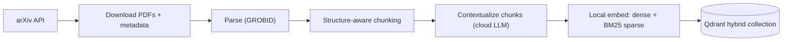
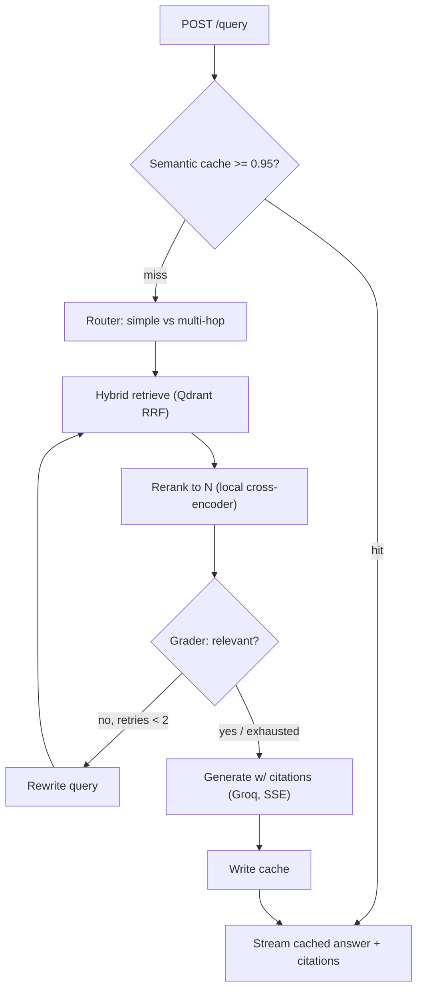

# CoreRAG

A low-latency, hallucination-resistant **agentic RAG** microservice over AI-Systems
literature (arXiv). It pairs **two-stage retrieval** (hybrid dense + BM25 recall → cross-encoder
precision) with a **LangGraph reflection loop** and a **semantic cache**, served over
streaming FastAPI with per-answer citations.

> Portfolio / research engineering piece. Full spec in [`PRD.md`](PRD.md); the build plan and
> phase tracker live in [`PLAN.md`](PLAN.md).

## Architecture

**Ingestion (offline):**



**Query (online):**



## Stack

| Layer | Choice |
| :-- | :-- |
| API | FastAPI (async, SSE) |
| Orchestration | LangGraph |
| Vector DB | Qdrant (dense + BM25 sparse, RRF) |
| Embeddings (local) | `BAAI/bge-base-en-v1.5` + BM25 |
| Reranker (local) | `Alibaba-NLP/gte-reranker-modernbert-base` |
| LLM — generation | Groq (Llama 3.3) |
| LLM — router/grader | OpenAI `gpt-4o-mini` |
| Cache | Redis (RedisVL semantic cache) |
| PDF parsing | GROBID |
| Observability | Langfuse |
| Eval | RAGAS + retrieval metrics |

## Quick start

**Prerequisites:** [uv](https://docs.astral.sh/uv/) and Docker Desktop.

```bash
# 1. Configure secrets
cp .env.example .env         # then add your GROQ_API_KEY and OPENAI_API_KEY

# 2. Install the environment (uv fetches a project-local Python 3.12)
make install

# 3. Start infrastructure (Qdrant + Redis)
make up

# 4. Run the API
make serve                   # http://localhost:8000/docs
curl -s localhost:8000/health | jq
```

> **macOS note:** if `docker` isn't on your PATH, add Docker Desktop's CLI:
> `export PATH="/Applications/Docker.app/Contents/Resources/bin:$PATH"`.

## Developer tasks

| Command | What it does |
| :-- | :-- |
| `make check` | Lint + type-check + unit tests (the full gate) |
| `make fmt` | Auto-format and auto-fix |
| `make test` | Unit tests (skips integration) |
| `make test-int` | Integration tests (needs `make up`) |
| `make up` / `make down` | Start / stop core services |
| `make up-obs` | Start Langfuse (observability profile) |
| `make up-ingest` | Start GROBID (ingestion profile) |
| `make serve` | Run the API with reload |
| `make ingest` | Run the ingestion pipeline |
| `make install-eval` | Sync the `eval` dependency group (RAGAS + friends) |
| `make eval` | Retrieval metrics + RAGAS answer-quality metrics |
| `make eval-testset` | Generate the golden Q/A set (costs real $, run once) |
| `make eval-ablation` | Contextualization/retrieval ablation table |
| `make eval-cache` | Semantic-cache hit-rate/speedup benchmark |
| `make help` | List all targets |

## Layout

```text
api/      FastAPI app, routes, schemas, DI
core/     config, clients, logging, retrieval, reranker, cache, agents (LangGraph)
data/     ingestion pipeline (fetch, parse, chunk, contextualize, index)
eval/     golden-set generation, RAGAS, retrieval metrics, ablation, latency benchmarks
tests/    pytest (unit + integration)
```

## Status

**P0–P5 complete** — foundations, ingestion (150-paper AI-systems corpus), two-stage
retrieval, LangGraph agentic orchestration (router → retrieve → grade/reflect → generate),
a semantic cache, and a real evaluation suite. P6 (hosted live demo) is next — see
[`PLAN.md`](PLAN.md) for the full phase tracker and every real finding behind these numbers.

### Results (real, not placeholders — reproduce with `make eval` / `make eval-ablation` / `make eval-cache`)

**Retrieval quality** (hit@30 / MRR / nDCG@30, hybrid + rerank, full 181-question golden set):

| Metric | Score |
| :-- | --: |
| hit@30 | 0.967 |
| MRR | 0.853 |
| nDCG@30 | 0.882 |

**Answer quality** (RAGAS, judge = gpt-4o-mini, n=30 real graph runs):

| Metric | Score |
| :-- | --: |
| Faithfulness | 0.811 |
| Context precision | 0.884 |
| Context recall | 0.925 |
| Answer relevancy | 0.032† |

† RAGAS's `AnswerRelevancy` forces a score of 0 whenever it classifies an answer as
"noncommittal" — and this system's generator deliberately hedges ("the sources don't
fully establish X") rather than bluff when evidence is weak. Verified in isolation: the
identical answer scored ~0.73–1.0 with the hedge removed, 0.0 with it present. A real,
documented blind spot of the metric for honesty-first RAG systems, not a defect here —
see `PLAN.md` P5.4 for the full trace back to RAGAS's own source.

**Ablation** (contextualize_strategy × retrieval mode × reranker, 20-paper sample, n=28):

- **Hybrid clearly, consistently beats dense-only** on every strategy and reranker
  setting (e.g. MRR 0.830 hybrid vs. 0.682 dense-only, `none` strategy, rerank on).
- **Reranking substantially improves ranking quality** in the real deployed top-5 (MRR
  0.830 vs. 0.664 with it off, `none`/hybrid).
- **Per-chunk contextualization gives a real +10.7pp hit@30 improvement over no
  context in dense-only retrieval** (0.750 → 0.857) — real and worth keeping, though
  currently masked in the full hybrid+rerank pipeline where BM25 already performs
  near-ceiling. Full 12-cell table in `PLAN.md` P5.5.

**Semantic cache**: a repeat query returns in **~28ms** vs. **~12.8s** for a fresh
graph run — a **~450× speedup**, with zero LLM/retrieval calls on the hit path
(verified via absent trace lines, not just wall-clock feel).
