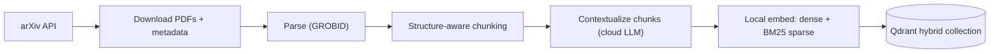
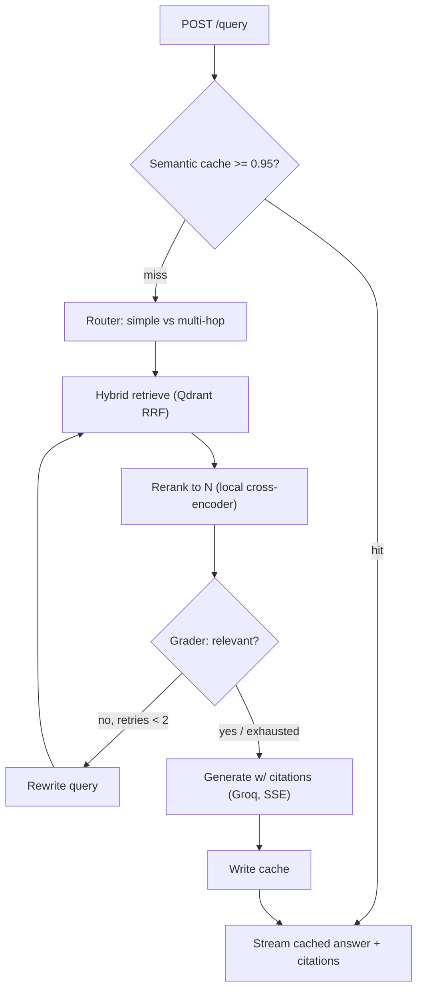

# CoreRAG

A low-latency, hallucination-resistant **agentic RAG** microservice over AI-Systems
literature (arXiv). It pairs **two-stage retrieval** (hybrid dense + BM25 recall → cross-encoder
precision) with a **LangGraph reflection loop** and a **semantic cache**, served over
streaming FastAPI with per-answer citations.

> Portfolio / research engineering piece. Full spec in [`PRD.md`](PRD.md); the build plan and
> phase tracker live in [`PLAN.md`](PLAN.md).

## Architecture

**Ingestion (offline):**



**Query (online):**



## Stack

| Layer | Choice |
| :-- | :-- |
| API | FastAPI (async, SSE) |
| Orchestration | LangGraph |
| Vector DB | Qdrant (dense + BM25 sparse, RRF) |
| Embeddings (local) | `Alibaba-NLP/gte-base-en-v1.5` + BM25 |
| Reranker (local) | `Alibaba-NLP/gte-reranker-modernbert-base` |
| LLM — generation | Groq (Llama 3.3) |
| LLM — router/grader | OpenAI `gpt-4o-mini` |
| Cache | Redis (RedisVL semantic cache) |
| PDF parsing | GROBID |
| Observability | Langfuse |
| Eval | RAGAS + retrieval metrics |

## Quick start

**Prerequisites:** [uv](https://docs.astral.sh/uv/) and Docker Desktop.

```bash
# 1. Configure secrets
cp .env.example .env         # then add your GROQ_API_KEY and OPENAI_API_KEY

# 2. Install the environment (uv fetches a project-local Python 3.12)
make install

# 3. Start infrastructure (Qdrant + Redis)
make up

# 4. Run the API
make serve                   # http://localhost:8000/docs
curl -s localhost:8000/health | jq
```

> **macOS note:** if `docker` isn't on your PATH, add Docker Desktop's CLI:
> `export PATH="/Applications/Docker.app/Contents/Resources/bin:$PATH"`.

## Developer tasks

| Command | What it does |
| :-- | :-- |
| `make check` | Lint + type-check + unit tests (the full gate) |
| `make fmt` | Auto-format and auto-fix |
| `make test` | Unit tests (skips integration) |
| `make test-int` | Integration tests (needs `make up`) |
| `make up` / `make down` | Start / stop core services |
| `make up-obs` | Start Langfuse (observability profile) |
| `make up-ingest` | Start GROBID (ingestion profile) |
| `make serve` | Run the API with reload |
| `make help` | List all targets |

## Layout

```text
api/      FastAPI app, routes, schemas, DI
core/     config, clients, logging  (+ retrieval/rerank/cache/agents to come)
data/     ingestion pipeline (fetch, parse, chunk, contextualize, index)
eval/     RAGAS + retrieval metrics + latency benchmarks
tests/    pytest (unit + integration)
```

## Status

Foundations (P0) are up: config-driven settings, Dockerized Qdrant + Redis, and a
`/health` readiness endpoint with structured logging. Retrieval, orchestration, caching,
evaluation, and the hosted demo follow — see [`PLAN.md`](PLAN.md) for the phase tracker.
