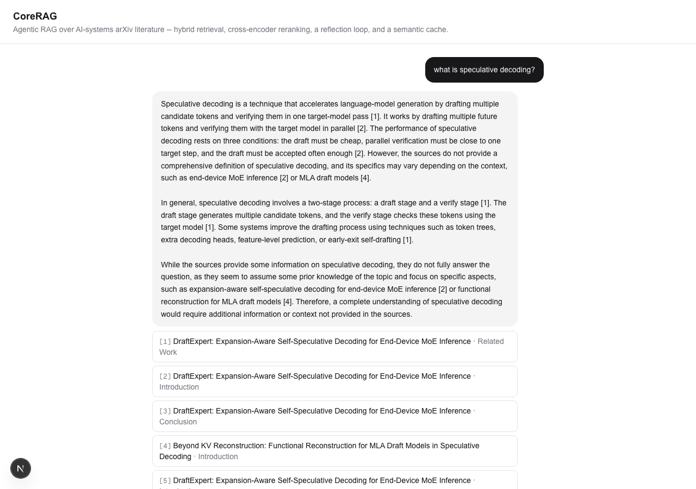
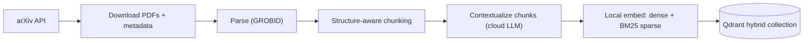
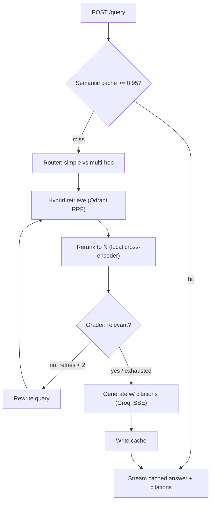

# CoreRAG

[](https://github.com/vanshiitd/corerag/actions/workflows/ci.yml)
[](LICENSE)
[](pyproject.toml)

A low-latency, hallucination-resistant **agentic RAG** system over AI-systems literature
(arXiv). It pairs **two-stage retrieval** (hybrid dense + BM25 recall → cross-encoder
precision) with a **LangGraph reflection loop** and a **semantic cache**, served over a
streaming FastAPI backend with per-answer citations and a Next.js chat UI.



## Contents

- [Features](#features)
- [Architecture](#architecture)
- [Stack](#stack)
- [Quick start](#quick-start)
- [Developer tasks](#developer-tasks)
- [Layout](#layout)
- [Deployment](#deployment)
- [Results](#results)
- [Documentation](#documentation)
- [License](#license)

## Features

- **Two-stage retrieval** — hybrid dense + BM25 recall (Qdrant RRF fusion), narrowed by
  a local cross-encoder reranker.
- **Agentic reflection loop** (LangGraph) — a router picks simple vs. multi-hop, a
  grader checks relevance and rewrites the query on a miss, bounded by a retry cap.
- **Grounded, cited generation** — every claim is tied to a numbered source passage;
  the model is instructed to abstain rather than fill gaps with unsupported claims.
- **Semantic cache** — a Redis-backed embedding cache serves repeat/near-duplicate
  queries in milliseconds instead of re-running the full graph.
- **Streaming API** — FastAPI + SSE: a token stream, a routing/reflection trace, and
  citations, delivered as the graph completes each stage.
- **Real, reproducible evaluation** — retrieval metrics (hit@k/MRR/nDCG), RAGAS
  answer-quality scoring, and a contextualization/retrieval ablation, all against a
  181-question golden set. See [Results](#results).

## Architecture

**Ingestion (offline):**



**Query (online):**



## Stack

| Layer | Choice |
| :-- | :-- |
| API | FastAPI (async, SSE) |
| Orchestration | LangGraph |
| Vector DB | Qdrant (dense + BM25 sparse, RRF) |
| Embeddings (local) | `BAAI/bge-base-en-v1.5` + BM25 |
| Reranker (local) | `Alibaba-NLP/gte-reranker-modernbert-base` |
| LLM — generation | Groq (Llama 3.3) |
| LLM — router/grader | OpenAI `gpt-4o-mini` |
| Cache | Redis (RedisVL semantic cache) |
| PDF parsing | GROBID |
| Observability | Langfuse |
| Eval | RAGAS + retrieval metrics |

## Quick start

This is the recommended, fastest way to run CoreRAG right now (see
[Deployment](#deployment) for why) — backend + UI both running locally, real query
latency in the 12–24s range.

**Prerequisites:** [uv](https://docs.astral.sh/uv/) and Docker Desktop.

```bash
# 1. Configure secrets
cp .env.example .env         # then add your GROQ_API_KEY and OPENAI_API_KEY

# 2. Install the environment (uv fetches a project-local Python 3.12)
make install

# 3. Start infrastructure (Qdrant + Redis)
make up

# 4. Run the API
make serve                   # http://localhost:8000/docs
curl -s localhost:8000/health | jq
```

> **macOS note:** if `docker` isn't on your PATH, add Docker Desktop's CLI:
> `export PATH="/Applications/Docker.app/Contents/Resources/bin:$PATH"`.

**Frontend** (`ui/`, Next.js — talks directly to the API in the browser rather than
through a Vercel serverless function, since Vercel's Hobby plan caps function execution
at 10s and a real, non-cached query takes 12–24s):

```bash
cd ui && npm install
cp .env.local.example .env.local   # point NEXT_PUBLIC_API_URL at your running API
npm run dev                        # http://localhost:3000
```

**Production image** (`Dockerfile`, repo root):

```bash
docker build -t corerag-api .
docker run --rm -p 8000:8000 -e PORT=8000 --env-file .env corerag-api
```

## Developer tasks

| Command | What it does |
| :-- | :-- |
| `make check` | Lint + type-check + unit tests (the full gate) |
| `make fmt` | Auto-format and auto-fix |
| `make test` | Unit tests (skips integration) |
| `make test-int` | Integration tests (needs `make up`) |
| `make up` / `make down` | Start / stop core services |
| `make up-obs` | Start Langfuse (observability profile) |
| `make up-ingest` | Start GROBID (ingestion profile) |
| `make serve` | Run the API with reload |
| `make ingest` | Run the ingestion pipeline |
| `make install-eval` | Sync the `eval` dependency group (RAGAS + friends) |
| `make eval` | Retrieval metrics + RAGAS answer-quality metrics |
| `make eval-testset` | Generate the golden Q/A set (costs real $, run once) |
| `make eval-ablation` | Contextualization/retrieval ablation table |
| `make eval-cache` | Semantic-cache hit-rate/speedup benchmark |
| `make help` | List all targets |

## Layout

```text
api/      FastAPI app, routes, schemas, DI, CORS + rate limiting
core/     config, clients, logging, retrieval, reranker, cache, agents (LangGraph), rate limiting
data/     ingestion pipeline (fetch, parse, chunk, contextualize, index)
eval/     golden-set generation, RAGAS, retrieval metrics, ablation, latency benchmarks
scripts/  ops scripts: cache pre-warming, keep-alive
ui/       Next.js chat frontend
tests/    pytest (unit + integration)
Dockerfile   production API image
```

## Deployment

Every piece — production Docker image, API hardening, the Next.js UI, cache
pre-warming, a Qdrant keep-alive — is built and verified live.

**Local (recommended).** Backend + UI both run end-to-end locally at 12–24s real query
latency, matching every benchmark in this project. See [Quick start](#quick-start).

**Cloud Run.** The backend is also deployed to Google Cloud Run against real Qdrant
Cloud + Redis Cloud instances — correct, but **slow**: real query latency there lands
at 100–240s, a ~15–25× slowdown vs. this project's Apple Silicon dev machine that two
rounds of real investigation (mode switching, thread-count tuning) couldn't close. Kept
running as a reference deployment; local is the practical way to actually use it. Full
investigation in [`PRD.md`](PRD.md#6-known-limitations--future-work).

## Results

Real, reproducible numbers — not placeholders. Reproduce with `make eval`,
`make eval-ablation`, or `make eval-cache`.

**Retrieval quality** (hit@30 / MRR / nDCG@30, hybrid + rerank, full 181-question golden set):

| Metric | Score |
| :-- | --: |
| hit@30 | 0.967 |
| MRR | 0.853 |
| nDCG@30 | 0.882 |

**Answer quality** (RAGAS, judge = gpt-4o-mini, n=55 real graph runs — 55/181 of the
golden set, checkpointed run stopped by Groq's shared daily generation-token quota
mid-eval; see `eval/ragas_eval.py` for the resumable design and how to extend this):

| Metric | Score |
| :-- | --: |
| Faithfulness | 0.797 |
| Context precision | 0.928 |
| Context recall | 0.932 |
| Answer relevancy | 0.046† |

Consistent with the earlier n=30 subset (0.811 / 0.884 / 0.925 / 0.032) — nearly double
the sample, same real story: faithful, well-grounded answers.

† RAGAS's `AnswerRelevancy` forces a score of 0 whenever it classifies an answer as
"noncommittal" — and this system's generator deliberately hedges ("the sources don't
fully establish X") rather than bluff when evidence is weak. Verified in isolation: the
identical answer scored ~0.73–1.0 with the hedge removed, 0.0 with it present. A real,
documented blind spot of the metric for honesty-first RAG systems, not a defect here —
see [`PRD.md`](PRD.md#4-evaluation) for the full trace back to RAGAS's own source.

**Ablation** (contextualize_strategy × retrieval mode × reranker, 20-paper sample, n=28):

- **Hybrid clearly, consistently beats dense-only** on every strategy and reranker
  setting (e.g. MRR 0.830 hybrid vs. 0.682 dense-only, `none` strategy, rerank on).
- **Reranking substantially improves ranking quality** in the real deployed top-5 (MRR
  0.830 vs. 0.664 with it off, `none`/hybrid).
- **Per-chunk contextualization gives a real +10.7pp hit@30 improvement over no
  context in dense-only retrieval** (0.750 → 0.857) — real and worth keeping, though
  currently masked in the full hybrid+rerank pipeline where BM25 already performs
  near-ceiling. Full 12-cell table in [`PRD.md`](PRD.md#4-evaluation).

**Semantic cache**: a repeat query returns in **~28ms** vs. **~12.8s** for a fresh
graph run — a **~450× speedup**, with zero LLM/retrieval calls on the hit path
(verified via absent trace lines, not just wall-clock feel).

## Documentation

- [`PRD.md`](PRD.md) — design rationale, evaluation methodology, and engineering
  write-ups

## License

[MIT](LICENSE)
